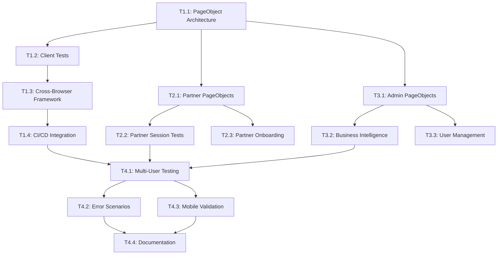

# Implementation Tasks: Comprehensive E2E Testing Suite

> **Epic**: Comprehensive End-to-End Testing Suite for FX-Orleans Platform  
> **Status**: Ready for Implementation  
> **Total Estimated Effort**: 240-320 hours (6-8 weeks)  

## Task Breakdown by Implementation Phase

### 📋 **Phase 1: Foundation & Client Tests** (Weeks 1-2)
**Priority**: P0 - Critical  
**Estimated Effort**: 80-100 hours

#### T1.1: Enhanced PageObject Architecture Setup
**Story Points**: 8  
**Assignee**: Lead QA Engineer + Frontend Developer  
**Dependencies**: Existing PageObject models

**Subtasks**:
- [ ] **T1.1.1**: Refactor existing PageObjects to support multi-persona inheritance
  - Update `BasePage.cs` with persona-specific methods
  - Create `ClientBasePage.cs`, `PartnerBasePage.cs`, `AdminBasePage.cs` abstractions
  - Implement shared authentication and navigation patterns
  - **Estimated**: 12 hours

- [ ] **T1.1.2**: Create Client PageObject Models
  - `ClientHomePage.cs` with problem submission workflows
  - `PartnerSelectionPage.cs` with AI matching result handling
  - `ClientBookingPage.cs` with scheduling and payment flows
  - `ClientConfirmationPage.cs` with booking validation
  - **Estimated**: 16 hours

- [ ] **T1.1.3**: Implement Shared Components
  - `AuthenticationPage.cs` with multi-persona OAuth handling
  - `NavigationHeader.cs` with role-based menu validation
  - `NotificationPanel.cs` with success/error message handling
  - **Estimated**: 8 hours

**Acceptance Criteria**:
- All existing tests continue to pass
- New PageObject architecture supports persona-based inheritance
- Code coverage maintained at >90%
- Documentation updated with new patterns

#### T1.2: Complete Client Journey Test Implementation
**Story Points**: 13  
**Assignee**: Lead QA Engineer  
**Dependencies**: T1.1 (PageObject Architecture)

**Subtasks**:
- [ ] **T1.2.1**: First-Time Client Complete Workflow Test
  - OAuth authentication with timeout handling
  - Problem statement submission with AI matching validation
  - Partner selection with profile review
  - Booking with calendar integration
  - Payment authorization with Stripe test cards
  - Confirmation with Google Meet link validation
  - **Estimated**: 20 hours

- [ ] **T1.2.2**: Returning Client Workflows
  - Rapid re-booking with preferred partners
  - Session history review and notes access
  - Follow-up consultation scheduling
  - Payment method management
  - **Estimated**: 12 hours

- [ ] **T1.2.3**: Client Edge Case Scenarios
  - Payment failures and retry flows
  - Partner unavailability handling
  - Session cancellation workflows
  - Mobile device booking experience
  - **Estimated**: 16 hours

**Acceptance Criteria**:
- Complete client journey executes successfully in <5 minutes
- All edge cases handled with proper error messages
- Cross-browser compatibility (Chrome, Firefox, Safari)
- Mobile responsiveness validated

#### T1.3: Cross-Browser Testing Framework
**Story Points**: 5  
**Assignee**: DevOps Engineer + QA Engineer  
**Dependencies**: T1.2 (Client Tests)

**Subtasks**:
- [ ] **T1.3.1**: Browser Configuration Matrix Setup
  - Chromium: 1920x1080, 90s timeout, 3 concurrent
  - Firefox: 1920x1080, 120s timeout, 1 concurrent
  - WebKit: 1920x1080, 120s timeout, 1 concurrent
  - Mobile Chrome: 375x667, 90s timeout, 2 concurrent
  - Mobile Safari: 375x667, 120s timeout, 1 concurrent
  - **Estimated**: 8 hours

- [ ] **T1.3.2**: Cross-Browser Test Execution Pipeline
  - Parallel test execution with browser isolation
  - Browser-specific timeout and retry configurations
  - Screenshot capture for failure analysis
  - **Estimated**: 12 hours

**Acceptance Criteria**:
- All client tests pass in all configured browsers
- Performance targets met for each browser
- Consistent user experience validated

#### T1.4: CI/CD Integration Configuration
**Story Points**: 8  
**Assignee**: DevOps Engineer  
**Dependencies**: T1.3 (Cross-Browser Framework)

**Subtasks**:
- [ ] **T1.4.1**: GitHub Actions Pipeline Setup
  - Playwright browser installation
  - Test execution with proper environment configuration
  - Test result reporting and artifact collection
  - **Estimated**: 12 hours

- [ ] **T1.4.2**: Azure DevOps Pipeline Configuration  
  - Alternative CI/CD option for enterprise environments
  - Test result publishing and failure notifications
  - Performance metric collection
  - **Estimated**: 8 hours

- [ ] **T1.4.3**: Test Categorization and Selective Execution
  - Smoke tests (<2 minutes) for quick validation
  - Full regression suite for comprehensive testing
  - Browser-specific test execution
  - **Estimated**: 4 hours

**Acceptance Criteria**:
- Tests execute automatically on PR creation
- Test failures block deployment pipeline
- Test results visible in PR status checks
- Performance metrics tracked over time

---

### 🎯 **Phase 2: Partner Workflow Implementation** (Weeks 3-4)  
**Priority**: P0 - Critical  
**Estimated Effort**: 80-100 hours

#### T2.1: Partner PageObject Models  
**Story Points**: 10  
**Assignee**: Lead QA Engineer + Backend Developer  
**Dependencies**: T1.1 (Enhanced PageObject Architecture)

**Subtasks**:
- [ ] **T2.1.1**: Partner Dashboard PageObjects
  - `PartnerDashboard.cs` with earnings and performance metrics
  - `SessionManagement.cs` with upcoming/completed session handling
  - `ProfileManagement.cs` with skills and availability updates
  - `EarningsPage.cs` with revenue tracking validation
  - **Estimated**: 16 hours

- [ ] **T2.1.2**: Session Delivery PageObjects
  - `SessionPreparation.cs` with client review workflows
  - `LiveSession.cs` with note-taking and completion flows
  - `PostSession.cs` with follow-up and rating workflows
  - **Estimated**: 12 hours

**Acceptance Criteria**:
- Partner-specific PageObjects inherit from `PartnerBasePage`
- All partner workflows have corresponding page object methods
- Error handling consistent with client-side patterns

#### T2.2: Partner Session Management Tests
**Story Points**: 13  
**Assignee**: Lead QA Engineer  
**Dependencies**: T2.1 (Partner PageObjects)

**Subtasks**:
- [ ] **T2.2.1**: Complete Session Delivery Workflow
  - Partner authentication and dashboard access
  - Session preparation and client review
  - Live session simulation with note-taking
  - Session completion and payment capture
  - Client follow-up and rating collection
  - **Estimated**: 24 hours

- [ ] **T2.2.2**: Partner Dashboard Validation
  - Earnings tracking accuracy
  - Performance metrics calculation
  - Client feedback integration
  - Schedule optimization features
  - **Estimated**: 12 hours

- [ ] **T2.2.3**: Revenue Tracking Validation
  - Payment capture timing and amounts
  - 80/20 revenue split accuracy
  - Monthly/quarterly earnings reports
  - Tax reporting data accuracy
  - **Estimated**: 8 hours

**Acceptance Criteria**:
- Complete partner workflow executes without errors
- Revenue calculations validated to cent accuracy
- Performance metrics match actual data
- Session notes properly captured and stored

#### T2.3: Partner Onboarding Workflow
**Story Points**: 8  
**Assignee**: Frontend Developer + QA Engineer  
**Dependencies**: T2.1 (Partner PageObjects)

**Subtasks**:
- [ ] **T2.3.1**: Partner Registration Process
  - Profile creation with skill assessment
  - Calendar integration setup
  - Availability management configuration
  - Verification workflow completion
  - **Estimated**: 16 hours

- [ ] **T2.3.2**: Sample Consultation Completion
  - First consultation preparation
  - Session delivery validation
  - Payment processing verification
  - Onboarding completion confirmation
  - **Estimated**: 8 hours

**Acceptance Criteria**:
- New partner can complete full onboarding process
- All integration points (calendar, payment) function properly
- Partner profile accurately reflects entered information

#### T2.4: Performance Profiling Integration
**Story Points**: 5  
**Assignee**: Backend Developer  
**Dependencies**: T2.2 (Partner Session Tests)

**Subtasks**:
- [ ] **T2.4.1**: Test Execution Performance Monitoring
  - Page load time measurement
  - Database query performance tracking
  - API response time validation
  - **Estimated**: 12 hours

- [ ] **T2.4.2**: Partner Workflow Optimization
  - Identify performance bottlenecks
  - Validate caching strategies
  - Monitor resource utilization
  - **Estimated**: 8 hours

**Acceptance Criteria**:
- Partner workflows meet performance targets (<3s page loads)
- Performance degradation alerts configured
- Optimization recommendations documented

---

### 👨‍💼 **Phase 3: Admin Operations & Analytics** (Weeks 5-6)  
**Priority**: P0 - Critical  
**Estimated Effort**: 64-80 hours

#### T3.1: Admin PageObject Models
**Story Points**: 8  
**Assignee**: Lead QA Engineer + Backend Developer  
**Dependencies**: T1.1 (Enhanced PageObject Architecture)

**Subtasks**:
- [ ] **T3.1.1**: Admin Dashboard PageObjects
  - `AdminDashboard.cs` with platform metrics and KPIs
  - `UserManagement.cs` with client/partner management
  - `Analytics.cs` with business intelligence features
  - `SystemHealth.cs` with platform monitoring
  - **Estimated**: 16 hours

- [ ] **T3.1.2**: Advanced Admin Features
  - `ComplianceReporting.cs` with audit and regulatory features
  - `FeatureFlags.cs` with A/B testing configuration
  - `SecurityAudit.cs` with access control validation
  - **Estimated**: 8 hours

**Acceptance Criteria**:
- Admin PageObjects inherit from `AdminBasePage`
- All admin functionality accessible through page objects
- Security-sensitive operations properly tested

#### T3.2: Business Intelligence Metrics Validation  
**Story Points**: 10  
**Assignee**: Backend Developer + QA Engineer  
**Dependencies**: T3.1 (Admin PageObjects)

**Subtasks**:
- [ ] **T3.2.1**: Platform Metrics Accuracy
  - Active user count validation
  - Monthly/quarterly revenue tracking
  - Partner utilization rate calculation
  - Client satisfaction score aggregation
  - **Estimated**: 16 hours

- [ ] **T3.2.2**: Analytics Dashboard Testing
  - Real-time metrics updates
  - Historical trend analysis
  - Custom report generation
  - Data export functionality
  - **Estimated**: 12 hours

**Acceptance Criteria**:
- All business metrics mathematically accurate
- Dashboard updates reflect real-time data
- Reports can be generated and exported successfully

#### T3.3: User Management Operations
**Story Points**: 8  
**Assignee**: Lead QA Engineer  
**Dependencies**: T3.1 (Admin PageObjects)

**Subtasks**:
- [ ] **T3.3.1**: Partner Approval Workflow
  - Pending partner review process
  - Skills and experience validation
  - Approval/rejection decision workflow
  - Notification system validation
  - **Estimated**: 12 hours

- [ ] **T3.3.2**: Client Account Management
  - Account review and support workflows
  - Payment history and dispute handling
  - Data privacy and GDPR compliance
  - Account suspension/restoration
  - **Estimated**: 8 hours

**Acceptance Criteria**:
- Partner approval process completes successfully
- Client account management operations function properly
- Compliance requirements met and validated

#### T3.4: Platform Health Monitoring
**Story Points**: 5  
**Assignee**: DevOps Engineer  
**Dependencies**: T3.1 (Admin PageObjects)

**Subtasks**:
- [ ] **T3.4.1**: System Health Validation
  - Service availability monitoring
  - Database performance metrics
  - Error rate tracking and alerting
  - **Estimated**: 8 hours

- [ ] **T3.4.2**: Compliance Reporting Automation
  - Audit trail generation
  - Data retention policy validation
  - Security incident reporting
  - **Estimated**: 4 hours

**Acceptance Criteria**:
- System health accurately reflects platform status
- Compliance reports generate successfully
- Alert systems function properly

---

### 🚀 **Phase 4: Advanced Scenarios & Performance** (Weeks 7-8)  
**Priority**: P1 - High  
**Estimated Effort**: 80-100 hours

#### T4.1: Multi-User Interaction Testing
**Story Points**: 13  
**Assignee**: Lead QA Engineer + Full Team  
**Dependencies**: All previous phases

**Subtasks**:
- [ ] **T4.1.1**: Cross-Persona Workflow Integration
  - Client booking triggers partner notifications
  - Partner actions update admin dashboards
  - Admin operations affect user experiences
  - **Estimated**: 20 hours

- [ ] **T4.1.2**: Concurrent User Load Testing
  - 10 concurrent client journeys
  - 5 concurrent partner operations
  - 2 concurrent admin sessions
  - Performance validation under load
  - **Estimated**: 16 hours

- [ ] **T4.1.3**: Data Consistency Validation
  - Cross-user data synchronization
  - Real-time update propagation
  - Cache invalidation testing
  - **Estimated**: 8 hours

**Acceptance Criteria**:
- Platform handles 50+ concurrent users successfully
- Data consistency maintained across all user types
- Performance targets met under load conditions

#### T4.2: Error Scenario Handling
**Story Points**: 10  
**Assignee**: Lead QA Engineer + Frontend Developer  
**Dependencies**: Core workflow implementations

**Subtasks**:
- [ ] **T4.2.1**: Payment Error Recovery
  - Declined card handling and user experience
  - Payment retry workflows
  - Partial payment scenarios
  - Refund processing validation
  - **Estimated**: 16 hours

- [ ] **T4.2.2**: Service Unavailability Handling
  - Partner unavailability scenarios
  - Third-party service outages (Stripe, Google Calendar)
  - Database connection failures
  - Graceful degradation validation
  - **Estimated**: 12 hours

**Acceptance Criteria**:
- All error scenarios handled gracefully
- Users receive clear error messages and recovery options
- No data loss during error conditions

#### T4.3: Mobile Responsiveness Validation
**Story Points**: 8  
**Assignee**: Frontend Developer + QA Engineer  
**Dependencies**: Core workflow implementations

**Subtasks**:
- [ ] **T4.3.1**: Mobile Client Experience
  - Responsive booking workflow on mobile devices
  - Touch-optimized partner selection
  - Mobile payment form validation
  - **Estimated**: 12 hours

- [ ] **T4.3.2**: Mobile Partner Dashboard
  - Session management on tablets
  - Mobile note-taking experience
  - Earnings review on small screens
  - **Estimated**: 8 hours

**Acceptance Criteria**:
- All core workflows function properly on mobile devices
- Touch interactions work correctly
- Mobile performance meets targets

#### T4.4: Documentation and Training Materials
**Story Points**: 5  
**Assignee**: Lead QA Engineer + Technical Writer  
**Dependencies**: All implementation tasks

**Subtasks**:
- [ ] **T4.4.1**: Comprehensive Test Documentation
  - Test execution guide with screenshots
  - Troubleshooting playbook for common issues
  - Page object API reference
  - CI/CD integration documentation
  - **Estimated**: 16 hours

- [ ] **T4.4.2**: Team Training Program
  - E2E testing concepts workshop
  - Hands-on training with test scenarios
  - Maintenance and debugging techniques
  - Knowledge validation and certification
  - **Estimated**: 8 hours

**Acceptance Criteria**:
- Complete documentation published and accessible
- Development team trained on test execution and maintenance
- Knowledge transfer completed and validated

---

## Risk Mitigation Tasks

### R1: OAuth Authentication Complexity
**Mitigation Task**: Enhanced Authentication Handling  
**Assignee**: Lead QA Engineer  
**Estimated**: 16 hours

- [ ] **R1.1**: Implement robust timeout handling for OAuth flows
- [ ] **R1.2**: Create fallback authentication methods for CI/CD
- [ ] **R1.3**: Add detailed logging for authentication troubleshooting
- [ ] **R1.4**: Document OAuth testing procedures and limitations

### R2: Test Execution Performance
**Mitigation Task**: Performance Optimization  
**Assignee**: DevOps Engineer  
**Estimated**: 12 hours

- [ ] **R2.1**: Implement parallel test execution with resource management
- [ ] **R2.2**: Create selective test execution categories
- [ ] **R2.3**: Optimize browser resource allocation
- [ ] **R2.4**: Add performance monitoring and alerting

### R3: Test Maintenance Overhead
**Mitigation Task**: Maintenance Reduction Strategy  
**Assignee**: Lead QA Engineer  
**Estimated**: 8 hours

- [ ] **R3.1**: Create robust page object patterns that resist UI changes
- [ ] **R3.2**: Implement smart wait strategies and retry mechanisms
- [ ] **R3.3**: Add comprehensive error reporting and debugging tools
- [ ] **R3.4**: Establish test review and maintenance procedures

## Task Dependencies & Critical Path

### Critical Path Analysis

### Estimated Timeline
- **Week 1-2**: Tasks T1.1 → T1.4 (Foundation & Client Tests)
- **Week 3-4**: Tasks T2.1 → T2.4 (Partner Workflows)  
- **Week 5-6**: Tasks T3.1 → T3.4 (Admin Operations)
- **Week 7-8**: Tasks T4.1 → T4.4 (Advanced Scenarios)

### Resource Allocation
- **Lead QA Engineer**: 280-320 hours (70-80%)
- **Frontend Developer**: 120-160 hours (30-40%)  
- **Backend Developer**: 80-120 hours (20-30%)
- **DevOps Engineer**: 60-80 hours (15-20%)
- **Technical Writer**: 16-24 hours (4-6%)

## Definition of Done

### Task-Level DoD
- [ ] All acceptance criteria met and verified
- [ ] Code review completed and approved
- [ ] Tests pass in all supported browsers
- [ ] Performance targets met (where applicable)
- [ ] Documentation updated
- [ ] No blocking bugs or security issues

### Epic-Level DoD
- [ ] 95% test coverage of critical user workflows achieved
- [ ] All three personas (Client, Partner, Admin) fully tested
- [ ] Cross-browser compatibility validated
- [ ] CI/CD integration functional
- [ ] Team training completed
- [ ] Production deployment readiness confirmed

---

**Epic Owner**: QA Engineering Team  
**Task Tracking**: Jira/Azure DevOps  
**Status Reporting**: Weekly progress updates  
**Review Cadence**: Bi-weekly task review and adjustment