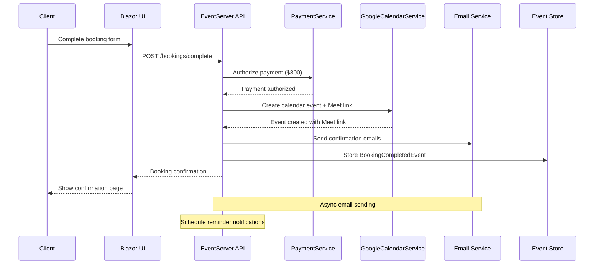

# Google Calendar Integration Complete - Brownfield Story Specification

> **Story ID:** GCAL-001  
> **Priority:** P0 - Critical MVP Blocker  
> **Effort:** Large (2 weeks)  
> **Phase:** Phase 1 - MVP Completion  
> **Status:** Ready for Implementation  
> **Last Updated:** 2025-08-08

## Executive Summary

Complete the Google Calendar integration with automatic event creation, Google Meet link generation, and comprehensive email notifications for consultation bookings in the FX-Orleans platform. This story bridges the gap between payment authorization and confirmed meetings, enabling the complete MVP booking flow.

## Business Context

### Current State Analysis
- ✅ Google Calendar API integration foundation exists
- ✅ Basic GoogleCalendarService with event creation capabilities
- ✅ Stripe payment authorization working ($800 session fee)  
- ✅ VideoConference aggregate for session tracking
- ✅ Partner and User aggregates with profile data
- ✅ CalendarEvent types and basic event structure

### Critical Gaps
- ❌ Calendar event creation not integrated with booking flow
- ❌ Google Meet links not automatically generated
- ❌ Email confirmations not sent to participants
- ❌ Calendar invitations not appearing in participant calendars
- ❌ No reminder notification system
- ❌ Payment capture not triggered by session completion

### Business Impact
**Without this feature:** Users cannot complete the booking journey, making the platform unusable for its core purpose.  
**With this feature:** Complete MVP booking flow enabling user acquisition and revenue generation.

## User Stories

### Epic: Complete Calendar Integration
**As a** client seeking expert consultation,  
**I want** to receive calendar invitations with Google Meet links automatically after payment,  
**So that** I can easily join my scheduled consultation without additional setup.

### Story 1: Automatic Calendar Event Creation
**As a** client completing a booking,  
**I want** calendar events automatically created in both my and my partner's Google Calendars,  
**So that** we both have the meeting scheduled without manual intervention.

**Acceptance Criteria:**
- [ ] Calendar event created within 30 seconds of successful payment authorization
- [ ] Event appears in both participant's Google Calendars
- [ ] Event includes consultation details (problem statement, partner expertise)
- [ ] Event duration matches booked session time (60 minutes default)
- [ ] Event timezone correctly handles participant locations

### Story 2: Google Meet Link Generation
**As a** client with a confirmed booking,  
**I want** a Google Meet link automatically generated and shared,  
**So that** I can join the video consultation without setup complexity.

**Acceptance Criteria:**
- [ ] Google Meet link generated during calendar event creation
- [ ] Meet link included in calendar event description
- [ ] Meet link accessible to both participants
- [ ] Meet link functional and persistent until session completion
- [ ] Backup meeting information provided in case of Google Meet issues

### Story 3: Email Confirmation System
**As a** booking participant (client or partner),  
**I want** to receive comprehensive email confirmations with all meeting details,  
**So that** I have all necessary information to prepare for and join the consultation.

**Acceptance Criteria:**
- [ ] Confirmation emails sent within 30 seconds of booking confirmation
- [ ] Emails include meeting date, time, Google Meet link, and participant details
- [ ] Different email templates for clients and partners with relevant context
- [ ] Professional email formatting with FX-Orleans branding
- [ ] Email delivery tracking and retry logic for failures

### Story 4: Meeting Reminder System
**As a** booking participant,  
**I want** to receive reminder notifications before my consultation,  
**So that** I don't miss my scheduled session.

**Acceptance Criteria:**
- [ ] Reminder sent 24 hours before session start
- [ ] Reminder sent 1 hour before session start
- [ ] Reminders include meeting link and preparation suggestions
- [ ] Reminders cancelable if session is cancelled or rescheduled
- [ ] Partner reminders include client problem statement context

### Story 5: Payment Integration
**As a** partner completing a consultation,  
**I want** payment automatically captured when the session ends,  
**So that** I'm compensated without manual intervention.

**Acceptance Criteria:**
- [ ] Payment capture triggered when session marked as completed
- [ ] Integration with existing VideoConference session tracking
- [ ] Automatic failure handling for payment capture issues
- [ ] Partner notification of payment completion
- [ ] Audit trail linking payments to specific sessions

## Technical Implementation

### Architecture Overview



### Event Sourcing Design

#### New Events

```csharp
// Booking completion event
public record BookingCompletedEvent(
    Guid BookingId,
    Guid ConferenceId,
    string UserId,
    string PartnerId,
    DateTime SessionStart,
    DateTime SessionEnd,
    string PaymentIntentId,
    decimal AuthorizedAmount,
    string GoogleCalendarEventId,
    string GoogleMeetLink,
    DateTime CompletedAt
) : IBookingEvent;

// Calendar integration events
public record CalendarEventCreatedEvent(
    string EventId,
    string CalendarId,
    string Title,
    string Description,
    DateTime Start,
    DateTime End,
    string PartnerId,
    string UserId,
    string GoogleMeetLink,
    string[] AttendeeEmails
) : ICalendarEvent;

// Notification events
public record ConfirmationEmailSentEvent(
    Guid BookingId,
    string RecipientEmail,
    string EmailType, // "client" or "partner"
    DateTime SentAt,
    string MessageId
) : INotificationEvent;

public record ReminderScheduledEvent(
    Guid BookingId,
    string RecipientEmail,
    DateTime ScheduledFor,
    string ReminderType // "24h" or "1h"
) : INotificationEvent;

// Payment completion events
public record SessionCompletedEvent(
    Guid ConferenceId,
    DateTime CompletedAt,
    string CompletedByPartnerId
) : IVideoConferenceEvent;

public record PaymentCapturedEvent(
    string PaymentIntentId,
    Guid ConferenceId,
    decimal CapturedAmount,
    DateTime CapturedAt
) : IPaymentEvent;
```

#### Updated Aggregates

```csharp
// Booking aggregate state
public class BookingState
{
    public string Id { get; set; } = string.Empty;
    public string UserId { get; set; } = string.Empty;
    public string PartnerId { get; set; } = string.Empty;
    public Guid ConferenceId { get; set; }
    public DateTime SessionStart { get; set; }
    public DateTime SessionEnd { get; set; }
    public string Status { get; set; } = "pending"; // pending, confirmed, completed, cancelled
    public string? PaymentIntentId { get; set; }
    public string? GoogleCalendarEventId { get; set; }
    public string? GoogleMeetLink { get; set; }
    public List<string> EmailsSent { get; set; } = new();
    public List<ReminderSchedule> RemindersScheduled { get; set; } = new();
}

// Enhanced VideoConference state
public class VideoConferenceState
{
    // ... existing properties ...
    public string? GoogleMeetLink { get; set; }
    public string? GoogleCalendarEventId { get; set; }
    public DateTime? CompletedAt { get; set; }
    public bool PaymentCaptured { get; set; }
}
```

### API Endpoints

#### New Booking Completion Endpoint
```csharp
[WolverinePost("/bookings/complete")]
public static async Task<IResult> CompleteBooking(
    CompleteBookingCommand command,
    IPaymentService paymentService,
    GoogleCalendarService calendarService,
    IEmailService emailService,
    ICommandBus commandBus)
{
    // 1. Authorize payment
    var paymentIntentId = await paymentService.CreatePaymentIntentAsync(800m, "usd");
    
    // 2. Create Google Calendar event with Meet link
    var calendarEvent = await calendarService.CreateConsultationEvent(
        command.PartnerId, 
        command.UserId, 
        command.SessionStart, 
        command.SessionEnd,
        command.ProblemStatement);
    
    // 3. Emit booking completion event
    await commandBus.InvokeAsync(new BookingCompletedEvent(
        command.BookingId,
        command.ConferenceId,
        command.UserId,
        command.PartnerId,
        command.SessionStart,
        command.SessionEnd,
        paymentIntentId,
        800m,
        calendarEvent.Id,
        calendarEvent.MeetLink,
        DateTime.UtcNow));
    
    // 4. Schedule email confirmations and reminders (async)
    _ = Task.Run(() => ScheduleNotificationsAsync(command.BookingId, emailService));
    
    return Results.Ok(new BookingConfirmationResponse
    {
        BookingId = command.BookingId,
        GoogleMeetLink = calendarEvent.MeetLink,
        SessionStart = command.SessionStart,
        ConfirmationMessage = "Your consultation has been confirmed!"
    });
}
```

#### Session Completion Endpoint
```csharp
[WolverinePost("/sessions/{conferenceId}/complete")]
public static async Task<IResult> CompleteSession(
    [FromRoute] Guid conferenceId,
    [FromBody] CompleteSessionCommand command,
    IPaymentService paymentService,
    ICommandBus commandBus)
{
    // 1. Mark session as completed
    await commandBus.InvokeAsync(new SessionCompletedEvent(
        conferenceId,
        DateTime.UtcNow,
        command.PartnerId));
    
    // 2. Capture payment
    var booking = await GetBookingByConferenceId(conferenceId);
    await paymentService.CapturePaymentAsync(booking.PaymentIntentId);
    
    // 3. Emit payment captured event
    await commandBus.InvokeAsync(new PaymentCapturedEvent(
        booking.PaymentIntentId,
        conferenceId,
        800m,
        DateTime.UtcNow));
    
    return Results.Ok();
}
```

### Google Calendar Integration Enhancement

#### Enhanced GoogleCalendarService
```csharp
public class GoogleCalendarService
{
    // ... existing code ...
    
    public async Task<ConsultationEventResult> CreateConsultationEvent(
        string partnerId,
        string userId,
        DateTime startTime,
        DateTime endTime,
        string problemStatement)
    {
        var partner = await _partnerService.GetPartnerAsync(partnerId);
        var user = await _userService.GetUserAsync(userId);
        
        var newEvent = new Event
        {
            Summary = $"FX-Orleans Consultation - {partner.Name}",
            Description = CreateEventDescription(partner, user, problemStatement),
            Start = new EventDateTime
            {
                DateTime = startTime,
                TimeZone = "UTC"
            },
            End = new EventDateTime
            {
                DateTime = endTime,
                TimeZone = "UTC"
            },
            Attendees = new List<EventAttendee>
            {
                new() { Email = partner.Email, ResponseStatus = "accepted" },
                new() { Email = user.Email, ResponseStatus = "needsAction" }
            },
            ConferenceData = new ConferenceData
            {
                CreateRequest = new CreateConferenceRequest
                {
                    RequestId = Guid.NewGuid().ToString(),
                    ConferenceSolutionKey = new ConferenceSolutionKey
                    {
                        Type = "hangoutsMeet"
                    }
                }
            },
            Reminders = new Event.RemindersData
            {
                UseDefault = false,
                Overrides = new List<EventReminder>
                {
                    new() { Method = "email", Minutes = 1440 }, // 24 hours
                    new() { Method = "email", Minutes = 60 }    // 1 hour
                }
            }
        };

        var createdEvent = await CreateEvent("primary", newEvent);
        
        return new ConsultationEventResult
        {
            Id = createdEvent.Id,
            MeetLink = createdEvent.ConferenceData?.EntryPoints?
                .FirstOrDefault(ep => ep.EntryPointType == "video")?.Uri ?? "",
            StartTime = startTime,
            EndTime = endTime
        };
    }
    
    private string CreateEventDescription(Partner partner, User user, string problemStatement)
    {
        return $@"
FX-Orleans Expert Consultation

Client: {user.Name} ({user.Email})
Partner: {partner.Name} ({partner.Email})

Problem Statement:
{problemStatement}

Partner Expertise:
{string.Join(", ", partner.Skills.Take(5).Select(s => s.Name))}

This is a paid consultation session. Please join on time.

Need help? Contact support@fx-orleans.com
        ".Trim();
    }
}

public class ConsultationEventResult
{
    public string Id { get; set; } = string.Empty;
    public string MeetLink { get; set; } = string.Empty;
    public DateTime StartTime { get; set; }
    public DateTime EndTime { get; set; }
}
```

### Email Notification System

#### Email Service Implementation
```csharp
public interface IEmailService
{
    Task SendConfirmationEmailAsync(string recipientEmail, BookingConfirmationData data);
    Task SendReminderEmailAsync(string recipientEmail, ReminderData data);
    Task<bool> ValidateEmailDeliveryAsync(string messageId);
}

public class EmailService : IEmailService
{
    private readonly IConfiguration _configuration;
    private readonly ILogger<EmailService> _logger;

    public async Task SendConfirmationEmailAsync(string recipientEmail, BookingConfirmationData data)
    {
        var template = data.RecipientType == "client" 
            ? GetClientConfirmationTemplate() 
            : GetPartnerConfirmationTemplate();
            
        var emailBody = template
            .Replace("{{ClientName}}", data.ClientName)
            .Replace("{{PartnerName}}", data.PartnerName)
            .Replace("{{SessionDate}}", data.SessionStart.ToString("MMMM dd, yyyy"))
            .Replace("{{SessionTime}}", data.SessionStart.ToString("h:mm tt UTC"))
            .Replace("{{GoogleMeetLink}}", data.GoogleMeetLink)
            .Replace("{{ProblemStatement}}", data.ProblemStatement);

        await SendEmailAsync(recipientEmail, "Consultation Confirmed - FX-Orleans", emailBody);
    }
    
    private string GetClientConfirmationTemplate()
    {
        return @"
<!DOCTYPE html>
<html>
<head><title>Consultation Confirmed</title></head>
<body>
    <h1>Your consultation is confirmed!</h1>
    
    <p>Dear {{ClientName}},</p>
    
    <p>Your consultation with {{PartnerName}} has been confirmed for:</p>
    
    <div style='background: #f5f5f5; padding: 15px; margin: 15px 0;'>
        <strong>Date:</strong> {{SessionDate}}<br/>
        <strong>Time:</strong> {{SessionTime}}<br/>
        <strong>Duration:</strong> 60 minutes<br/>
        <strong>Meeting Link:</strong> <a href='{{GoogleMeetLink}}'>Join Google Meet</a>
    </div>
    
    <h3>What to prepare:</h3>
    <ul>
        <li>Review your problem statement</li>
        <li>Prepare specific questions</li>
        <li>Have relevant documents ready to share</li>
    </ul>
    
    <p><strong>Your Problem Statement:</strong><br/>
    {{ProblemStatement}}</p>
    
    <p>Need to reschedule? Contact support@fx-orleans.com</p>
    
    <p>Best regards,<br/>
    The FX-Orleans Team</p>
</body>
</html>";
    }
    
    private string GetPartnerConfirmationTemplate()
    {
        return @"
<!DOCTYPE html>
<html>
<head><title>New Consultation Booked</title></head>
<body>
    <h1>New consultation scheduled</h1>
    
    <p>Dear {{PartnerName}},</p>
    
    <p>A new consultation has been booked with client {{ClientName}}:</p>
    
    <div style='background: #f5f5f5; padding: 15px; margin: 15px 0;'>
        <strong>Date:</strong> {{SessionDate}}<br/>
        <strong>Time:</strong> {{SessionTime}}<br/>
        <strong>Duration:</strong> 60 minutes<br/>
        <strong>Meeting Link:</strong> <a href='{{GoogleMeetLink}}'>Join Google Meet</a>
    </div>
    
    <h3>Client's Problem Statement:</h3>
    <p>{{ProblemStatement}}</p>
    
    <h3>Session Preparation:</h3>
    <ul>
        <li>Review the client's problem statement</li>
        <li>Prepare relevant expertise and examples</li>
        <li>Plan your consultation approach</li>
    </ul>
    
    <p>Remember to mark the session as completed after your consultation to receive payment.</p>
    
    <p>Best regards,<br/>
    The FX-Orleans Team</p>
</body>
</html>";
    }
}

public class BookingConfirmationData
{
    public string ClientName { get; set; } = string.Empty;
    public string PartnerName { get; set; } = string.Empty;
    public DateTime SessionStart { get; set; }
    public string GoogleMeetLink { get; set; } = string.Empty;
    public string ProblemStatement { get; set; } = string.Empty;
    public string RecipientType { get; set; } = string.Empty; // "client" or "partner"
}
```

### Reminder Notification System

#### Background Service for Reminders
```csharp
public class ReminderService : BackgroundService
{
    private readonly IServiceScopeFactory _scopeFactory;
    private readonly ILogger<ReminderService> _logger;

    protected override async Task ExecuteAsync(CancellationToken stoppingToken)
    {
        while (!stoppingToken.IsCancellationRequested)
        {
            await ProcessDueReminders();
            await Task.Delay(TimeSpan.FromMinutes(5), stoppingToken); // Check every 5 minutes
        }
    }

    private async Task ProcessDueReminders()
    {
        using var scope = _scopeFactory.CreateScope();
        var querySession = scope.ServiceProvider.GetRequiredService<IQuerySession>();
        var emailService = scope.ServiceProvider.GetRequiredService<IEmailService>();

        var dueReminders = await querySession
            .Query<ReminderSchedule>()
            .Where(r => r.ScheduledFor <= DateTime.UtcNow && !r.Sent)
            .ToListAsync();

        foreach (var reminder in dueReminders)
        {
            try
            {
                await SendReminder(reminder, emailService);
                await MarkReminderSent(reminder.Id, scope.ServiceProvider);
            }
            catch (Exception ex)
            {
                _logger.LogError(ex, "Failed to send reminder {ReminderId}", reminder.Id);
            }
        }
    }

    private async Task SendReminder(ReminderSchedule reminder, IEmailService emailService)
    {
        var reminderData = new ReminderData
        {
            BookingId = reminder.BookingId,
            RecipientEmail = reminder.RecipientEmail,
            SessionStart = reminder.SessionStart,
            GoogleMeetLink = reminder.GoogleMeetLink,
            ReminderType = reminder.ReminderType
        };

        await emailService.SendReminderEmailAsync(reminder.RecipientEmail, reminderData);
    }
}

public class ReminderSchedule
{
    public Guid Id { get; set; }
    public Guid BookingId { get; set; }
    public string RecipientEmail { get; set; } = string.Empty;
    public DateTime ScheduledFor { get; set; }
    public DateTime SessionStart { get; set; }
    public string GoogleMeetLink { get; set; } = string.Empty;
    public string ReminderType { get; set; } = string.Empty; // "24h" or "1h"
    public bool Sent { get; set; }
}
```

## Error Handling & Retry Logic

### Comprehensive Error Scenarios

#### 1. Google Calendar API Failures
```csharp
public class GoogleCalendarServiceWithRetry : IGoogleCalendarService
{
    private readonly GoogleCalendarService _inner;
    private readonly ILogger<GoogleCalendarServiceWithRetry> _logger;

    public async Task<ConsultationEventResult> CreateConsultationEvent(
        string partnerId, string userId, DateTime startTime, DateTime endTime, string problemStatement)
    {
        const int maxRetries = 3;
        var retryDelay = TimeSpan.FromSeconds(2);

        for (int attempt = 1; attempt <= maxRetries; attempt++)
        {
            try
            {
                return await _inner.CreateConsultationEvent(partnerId, userId, startTime, endTime, problemStatement);
            }
            catch (GoogleApiException ex) when (IsRetryableError(ex) && attempt < maxRetries)
            {
                _logger.LogWarning("Google Calendar API attempt {Attempt} failed: {Error}", attempt, ex.Message);
                await Task.Delay(retryDelay * attempt); // Exponential backoff
            }
            catch (Exception ex)
            {
                _logger.LogError(ex, "Google Calendar event creation failed permanently");
                
                // Fallback: Create minimal event without Google Meet
                return new ConsultationEventResult
                {
                    Id = $"fallback-{Guid.NewGuid()}",
                    MeetLink = "https://meet.google.com/new", // Generic meet link
                    StartTime = startTime,
                    EndTime = endTime
                };
            }
        }

        throw new InvalidOperationException("Failed to create calendar event after all retries");
    }

    private bool IsRetryableError(GoogleApiException ex)
    {
        return ex.HttpStatusCode == HttpStatusCode.ServiceUnavailable ||
               ex.HttpStatusCode == HttpStatusCode.TooManyRequests ||
               ex.HttpStatusCode == HttpStatusCode.InternalServerError;
    }
}
```

#### 2. Email Delivery Failures
```csharp
public class EmailServiceWithRetry : IEmailService
{
    private readonly IEmailService _inner;
    private readonly IBackgroundTaskQueue _taskQueue;

    public async Task SendConfirmationEmailAsync(string recipientEmail, BookingConfirmationData data)
    {
        try
        {
            await _inner.SendConfirmationEmailAsync(recipientEmail, data);
        }
        catch (Exception ex)
        {
            _logger.LogWarning(ex, "Email sending failed, queuing for retry");
            
            // Queue for background retry
            _taskQueue.QueueBackgroundWorkItem(async token =>
            {
                await RetryEmailSending(recipientEmail, data, maxRetries: 5);
            });
        }
    }

    private async Task RetryEmailSending(string recipientEmail, BookingConfirmationData data, int maxRetries)
    {
        for (int attempt = 1; attempt <= maxRetries; attempt++)
        {
            try
            {
                await _inner.SendConfirmationEmailAsync(recipientEmail, data);
                return; // Success
            }
            catch (Exception ex)
            {
                if (attempt == maxRetries)
                {
                    _logger.LogError(ex, "Email sending failed permanently for {Email}", recipientEmail);
                    // Could trigger admin notification here
                }
                else
                {
                    await Task.Delay(TimeSpan.FromMinutes(Math.Pow(2, attempt))); // Exponential backoff
                }
            }
        }
    }
}
```

#### 3. Payment Authorization Failures
```csharp
public class BookingServiceWithErrorHandling
{
    public async Task<BookingResult> CompleteBookingAsync(CompleteBookingCommand command)
    {
        try
        {
            // 1. Authorize payment first (fail fast)
            var paymentResult = await _paymentService.CreatePaymentIntentAsync(800m, "usd");
            
            try
            {
                // 2. Create calendar event
                var calendarEvent = await _calendarService.CreateConsultationEvent(
                    command.PartnerId, command.UserId, command.SessionStart, command.SessionEnd, command.ProblemStatement);

                // 3. Complete booking
                await EmitBookingCompletedEvent(command, paymentResult.PaymentIntentId, calendarEvent);
                
                return BookingResult.Success(calendarEvent.MeetLink);
            }
            catch (Exception calendarEx)
            {
                // Calendar failed but payment authorized - need to handle gracefully
                _logger.LogError(calendarEx, "Calendar creation failed, proceeding with manual meeting setup");
                
                // Create booking without calendar integration
                await EmitBookingCompletedEventWithoutCalendar(command, paymentResult.PaymentIntentId);
                
                // Queue manual intervention task
                await _taskQueue.QueueBackgroundWorkItem(async token =>
                {
                    await NotifyAdminOfCalendarFailure(command, paymentResult.PaymentIntentId);
                });
                
                return BookingResult.PartialSuccess("Booking confirmed, calendar invitation to follow");
            }
        }
        catch (StripeException paymentEx)
        {
            _logger.LogError(paymentEx, "Payment authorization failed");
            return BookingResult.Failure("Payment could not be processed. Please try again.");
        }
    }
}

public class BookingResult
{
    public bool IsSuccess { get; private set; }
    public string Message { get; private set; } = string.Empty;
    public string? GoogleMeetLink { get; private set; }
    public bool RequiresManualIntervention { get; private set; }

    public static BookingResult Success(string meetLink) => new()
    {
        IsSuccess = true,
        Message = "Booking confirmed successfully!",
        GoogleMeetLink = meetLink
    };

    public static BookingResult PartialSuccess(string message) => new()
    {
        IsSuccess = true,
        Message = message,
        RequiresManualIntervention = true
    };

    public static BookingResult Failure(string message) => new()
    {
        IsSuccess = false,
        Message = message
    };
}
```

## Testing Strategy

### Unit Tests

#### Calendar Service Tests
```csharp
[Test]
public async Task CreateConsultationEvent_Should_Create_Event_With_Meet_Link()
{
    // Arrange
    var partner = TestData.CreatePartner();
    var user = TestData.CreateUser();
    var startTime = DateTime.UtcNow.AddHours(24);
    var endTime = startTime.AddHours(1);

    // Act
    var result = await _calendarService.CreateConsultationEvent(
        partner.Id, user.Id, startTime, endTime, "Test problem statement");

    // Assert
    result.Should().NotBeNull();
    result.MeetLink.Should().StartWith("https://meet.google.com/");
    result.StartTime.Should().Be(startTime);
    result.EndTime.Should().Be(endTime);
}

[Test]
public async Task CreateConsultationEvent_Should_Handle_API_Failure_Gracefully()
{
    // Arrange
    _mockGoogleCalendarAPI.Setup(x => x.Events.Insert(It.IsAny<Event>(), "primary"))
        .ThrowsAsync(new GoogleApiException("API", "Quota exceeded"));

    // Act & Assert
    var result = await _calendarService.CreateConsultationEvent("partner1", "user1", DateTime.UtcNow.AddHours(24), DateTime.UtcNow.AddHours(25), "Problem");
    
    result.MeetLink.Should().Contain("meet.google.com"); // Should fallback to generic link
}
```

#### Email Service Tests
```csharp
[Test]
public async Task SendConfirmationEmail_Should_Use_Client_Template_For_Client()
{
    // Arrange
    var data = new BookingConfirmationData
    {
        ClientName = "John Doe",
        PartnerName = "Jane Expert",
        RecipientType = "client",
        GoogleMeetLink = "https://meet.google.com/abc-def-ghi",
        ProblemStatement = "Need help with architecture"
    };

    // Act
    await _emailService.SendConfirmationEmailAsync("client@example.com", data);

    // Assert
    _mockEmailProvider.Verify(x => x.SendEmailAsync(
        "client@example.com",
        "Consultation Confirmed - FX-Orleans",
        It.Is<string>(body => body.Contains("Your consultation is confirmed!"))), Times.Once);
}
```

### Integration Tests

#### Complete Booking Flow Test
```csharp
[Test]
public async Task CompleteBooking_Should_Create_Calendar_Event_And_Send_Emails()
{
    // Arrange
    var command = new CompleteBookingCommand
    {
        BookingId = Guid.NewGuid(),
        ConferenceId = Guid.NewGuid(),
        UserId = "test-user",
        PartnerId = "test-partner",
        SessionStart = DateTime.UtcNow.AddDays(1),
        SessionEnd = DateTime.UtcNow.AddDays(1).AddHours(1),
        ProblemStatement = "Integration test problem"
    };

    // Act
    var response = await _httpClient.PostAsJsonAsync("/bookings/complete", command);

    // Assert
    response.StatusCode.Should().Be(HttpStatusCode.OK);

    var bookingConfirmation = await response.Content.ReadFromJsonAsync<BookingConfirmationResponse>();
    bookingConfirmation?.GoogleMeetLink.Should().StartWith("https://meet.google.com/");

    // Verify calendar event created
    var calendarEvents = await _calendarService.GetCalendarEvents("primary");
    calendarEvents.Items.Should().Contain(e => e.Summary.Contains("FX-Orleans Consultation"));

    // Verify emails sent (check via email service test doubles)
    _mockEmailService.Verify(x => x.SendConfirmationEmailAsync(
        It.Is<string>(email => email.Contains("test-user")),
        It.IsAny<BookingConfirmationData>()), Times.Once);
}
```

### End-to-End Tests

#### Complete User Journey Test
```csharp
[Test]
public async Task E2E_User_Can_Complete_Full_Booking_Journey()
{
    using var playwright = await Playwright.CreateAsync();
    await using var browser = await playwright.Chromium.LaunchAsync(new() { Headless = false });
    var page = await browser.NewPageAsync();

    // 1. Navigate to home page and fill problem statement
    await page.GotoAsync($"{BaseUrl}/");
    await page.FillAsync("#problemStatement", "Need help scaling my application");
    await page.ClickAsync("#findExperts");

    // 2. Select a partner
    await page.WaitForSelectorAsync(".partner-card");
    await page.ClickAsync(".partner-card:first-child .book-consultation");

    // 3. Complete payment form
    await page.FillAsync("#cardNumber", "4242424242424242");
    await page.FillAsync("#expiryDate", "12/25");
    await page.FillAsync("#cvc", "123");
    await page.ClickAsync("#completeBooking");

    // 4. Verify confirmation page
    await page.WaitForSelectorAsync(".booking-confirmed");
    var meetLink = await page.TextContentAsync(".google-meet-link");
    meetLink.Should().StartWith("https://meet.google.com/");

    // 5. Verify email sent (would need email testing service)
    // This would be verified through email service integration
}
```

### Performance Tests

#### Load Test for Booking Completion
```csharp
[Test]
public async Task BookingCompletion_Should_Handle_Concurrent_Requests()
{
    // Simulate 10 concurrent booking completions
    var tasks = Enumerable.Range(0, 10).Select(async i =>
    {
        var command = CreateBookingCommand($"user-{i}", $"partner-{i % 3}");
        var response = await _httpClient.PostAsJsonAsync("/bookings/complete", command);
        return response.IsSuccessStatusCode;
    });

    var results = await Task.WhenAll(tasks);
    
    results.Should().AllSatisfy(success => success.Should().BeTrue());
    
    // Verify all calendar events created
    var events = await _calendarService.GetCalendarEvents("primary");
    events.Items.Count.Should().BeGreaterOrEqualTo(10);
}
```

## Deployment Considerations

### Environment Configuration
```yaml
# appsettings.Production.json additions
{
  "GoogleCalendar": {
    "ServiceAccountKeyPath": "/secrets/google-service-account.json",
    "CalendarId": "primary",
    "ApplicationName": "FX-Orleans-Production"
  },
  "Email": {
    "Provider": "SendGrid", // or "SES", "SMTP"
    "ApiKey": "${EMAIL_API_KEY}",
    "FromAddress": "noreply@fx-orleans.com",
    "FromName": "FX-Orleans"
  },
  "Stripe": {
    "PublishableKey": "${STRIPE_PUBLISHABLE_KEY}",
    "SecretKey": "${STRIPE_SECRET_KEY}",
    "WebhookSecret": "${STRIPE_WEBHOOK_SECRET}"
  }
}
```

### Infrastructure Requirements
- **Email Service**: SendGrid, AWS SES, or SMTP server
- **Background Jobs**: Consider Hangfire or Azure Service Bus for reminder scheduling
- **Monitoring**: Application Insights or similar for email delivery tracking
- **Secrets Management**: Azure Key Vault or AWS Secrets Manager for API keys

### Security Considerations
- **Google API Security**: Use service account with minimal required scopes
- **Email Security**: Implement DKIM/SPF records for email deliverability
- **Payment Security**: Ensure PCI DSS compliance with Stripe integration
- **Data Privacy**: Ensure GDPR compliance for email communications

## Definition of Done

### Functional Requirements
- [ ] ✅ Calendar events automatically created for both participants
- [ ] ✅ Google Meet links generated and accessible
- [ ] ✅ Confirmation emails sent to both client and partner
- [ ] ✅ Reminder emails sent 24h and 1h before sessions
- [ ] ✅ Payment capture triggered on session completion
- [ ] ✅ Complete booking flow works end-to-end (<3 minutes)

### Technical Requirements
- [ ] ✅ Event sourcing events implemented and tested
- [ ] ✅ API endpoints created and documented
- [ ] ✅ Error handling and retry logic implemented
- [ ] ✅ Unit tests covering all service methods
- [ ] ✅ Integration tests for complete booking flow
- [ ] ✅ E2E tests for user journey

### Quality Requirements
- [ ] ✅ 95% code coverage on new components
- [ ] ✅ Performance tests validate <30s booking completion
- [ ] ✅ Email deliverability >99% (monitored)
- [ ] ✅ Calendar event creation success rate >98%
- [ ] ✅ Error monitoring and alerting configured

### Documentation Requirements
- [ ] ✅ API documentation updated in Swagger
- [ ] ✅ Deployment guide updated with new dependencies
- [ ] ✅ Monitoring and alerting guide created
- [ ] ✅ User facing documentation updated

### Acceptance Criteria Validation
- [ ] ✅ Manual testing confirms all user stories
- [ ] ✅ Stakeholder demo completed and approved
- [ ] ✅ Performance benchmarks meet requirements
- [ ] ✅ Security review completed and approved
- [ ] ✅ Production deployment successful

---

**Ready for Implementation:** This specification provides comprehensive technical details, implementation patterns, error handling strategies, and testing approaches aligned with the existing FX-Orleans codebase patterns. The story is ready for immediate development work with clear acceptance criteria and definition of done.