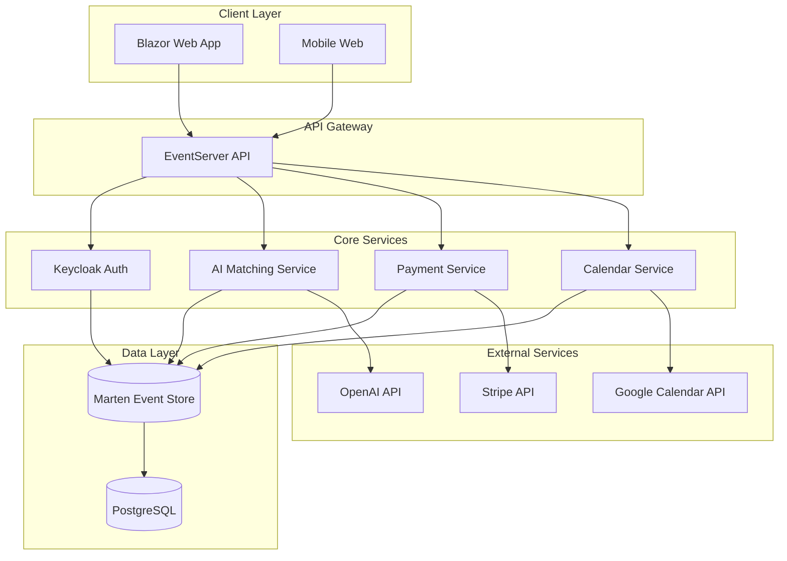

# Product Requirements Document: FX-Orleans
## AI-Powered Expert Consultation Platform

> **Document Version**: 2.0.0  
> **Date**: 2025-08-08  
> **Status**: Active Development - Brownfield Project  
> **Document Type**: Product Requirements Document (PRD)

---

## Executive Summary

### Project Overview
FX-Orleans is an AI-powered expert consultation platform that connects businesses needing fractional executive leadership (CIO, CTO, CISO) with qualified Fortium partners through intelligent matching, integrated booking, and secure payment processing.

### Project Status: Brownfield Development
This is a **brownfield project** with significant existing infrastructure:
- ✅ **MVP Foundation Complete**: Event sourcing architecture, authentication, basic UI
- ✅ **Core Systems Operational**: AI matching, payment authorization, partner management
- ✅ **Technical Infrastructure**: Docker containerization, monitoring, E2E testing
- 🔄 **Phase 1 In Progress**: Completing booking flow, payment capture, calendar integration
- 📋 **Phases 2-5 Planned**: Enhanced UX, business intelligence, scaling, enterprise features

### Strategic Context
- **Business Model**: 80/20 revenue split (80% partner, 20% platform)
- **Pricing Strategy**: $800 fixed price for 60-minute consultations
- **Market Position**: AI-differentiated alternative to traditional consulting marketplaces
- **Technical Approach**: Event sourcing + CQRS for scalability and audit compliance

---

## 1. Product Vision & Strategy

### 1.1 Vision Statement
*"To become the leading AI-powered platform connecting businesses with fractional executive expertise, delivering instant access to qualified leadership guidance through intelligent matching and seamless consultation experiences."*

### 1.2 Strategic Objectives

#### Primary Objectives (2025)
1. **Complete MVP to Market**: Finish Phase 1 booking flow and launch beta program
2. **Achieve Product-Market Fit**: 90%+ consultation completion rate, 4.5+ NPS score
3. **Scale Partner Network**: Onboard 50+ verified fractional executives
4. **Revenue Generation**: $100K ARR through platform transactions

#### Secondary Objectives (2025-2026)
1. **Market Expansion**: Support multiple expertise areas beyond C-level roles
2. **AI Enhancement**: Implement learning algorithms for improved matching accuracy
3. **Enterprise Adoption**: Secure 10+ enterprise clients with multi-session packages
4. **Platform Optimization**: Sub-3-second AI matching, 99.9% payment success rate

### 1.3 Success Metrics

#### Business Metrics
- **Monthly Recurring Revenue (MRR)**: Target $25K by Q4 2025
- **Customer Acquisition Cost (CAC)**: <$200 per client
- **Lifetime Value (LTV)**: >$2,000 per client
- **Partner Utilization**: 70%+ monthly booking rate for active partners

#### Product Metrics
- **Consultation Completion Rate**: >90%
- **AI Matching Accuracy**: >85% client satisfaction with recommendations
- **Booking Conversion**: >60% from partner selection to completed payment
- **Platform Uptime**: 99.9% availability

#### User Experience Metrics
- **Time to Match**: <30 seconds for AI recommendations
- **Booking Flow Completion**: <5 minutes average
- **Net Promoter Score (NPS)**: >70 for clients, >80 for partners
- **Support Ticket Volume**: <5% of transactions require assistance

---

## 2. Current System State Analysis

### 2.1 Existing Technical Architecture

#### ✅ Implemented Systems
```
Core Infrastructure (90% Complete)
├── Event Sourcing + CQRS Architecture
│   ├── Marten Event Store with PostgreSQL
│   ├── Wolverine HTTP for command/query handling
│   └── Domain aggregates (User, Partner, Payment, VideoConference)
├── Authentication & Authorization
│   ├── Keycloak integration with OpenID Connect
│   ├── Google OAuth provider configuration
│   └── Role-based access control (Client/Partner/Admin)
├── AI Matching System
│   ├── OpenAI GPT-4 integration with RAG
│   ├── Partner skill and experience matching
│   └── Natural language problem analysis
├── Payment Infrastructure
│   ├── Stripe integration with authorize-first model
│   ├── Payment intent creation and management
│   └── Revenue sharing calculation (80/20 split)
├── Frontend Application
│   ├── Blazor Server + WebAssembly hybrid
│   ├── MudBlazor component library
│   ├── Responsive design with dark/light themes
│   └── User profile management
└── Development Infrastructure
    ├── Docker containerization
    ├── E2E testing with Playwright + NUnit
    ├── Monitoring with Prometheus/Grafana
    └── CI/CD pipeline foundations
```

#### 🔄 In-Progress Systems (Phase 1 - 60% Complete)
- **Google Calendar Integration**: API setup complete, booking creation pending
- **Payment Capture Flow**: Authorization working, capture after session pending
- **Email Notifications**: Infrastructure ready, template implementation needed
- **Session Management**: Basic video conference tracking, completion workflow needed

#### ❌ Missing Critical Components
- **Partner Onboarding Flow**: Manual process, needs automated workflow
- **Session Notes Management**: Partner note-taking during consultations
- **Advanced Partner Search**: Filtering beyond AI matching
- **Business Intelligence Dashboard**: Analytics for partners and admins
- **Mobile Optimization**: Responsive design needs mobile-specific UX

### 2.2 Current User Experience Flows

#### ✅ Working User Journeys
1. **User Registration**: Authentication via Google OAuth ✅
2. **Problem Statement Submission**: AI matching with partner recommendations ✅
3. **Partner Profile Viewing**: Skills, experience, availability display ✅
4. **Payment Authorization**: Stripe integration for $800 session fee ✅
5. **User Profile Management**: Address, preferences, theme settings ✅

#### 🔄 Partially Working Journeys
1. **Booking Confirmation**: Payment authorized, calendar integration pending
2. **Session Scheduling**: Google Calendar events created, Meet links pending
3. **Partner Dashboard**: Basic login/logout, profile management incomplete

#### ❌ Missing User Journeys
1. **Session Completion Workflow**: Post-session notes, payment capture
2. **Partner Onboarding**: Skills assessment, verification, training
3. **Session History**: Past consultations, notes, follow-up scheduling
4. **Mobile Experience**: Touch-optimized booking and consultation flows

### 2.3 Technical Debt Assessment

#### High Priority Technical Debt
1. **Error Handling Inconsistency**: Some components lack comprehensive error boundaries
2. **Frontend State Management**: Blazor Server SignalR connection reliability issues
3. **Test Coverage Gaps**: E2E tests exist but unit test coverage needs improvement
4. **Configuration Management**: Mix of user secrets and environment variables
5. **Database Migrations**: Event sourcing projections need versioning strategy

#### Medium Priority Technical Debt
1. **API Documentation**: Swagger setup exists but needs comprehensive endpoint docs
2. **Logging Standardization**: Structured logging implemented but needs consistency
3. **Performance Optimization**: No caching strategy for AI matching results
4. **Security Hardening**: Basic authentication works but needs enterprise-grade features

#### Low Priority Technical Debt
1. **Code Organization**: Some large files could benefit from refactoring
2. **Dependency Management**: Regular security updates needed
3. **Development Tooling**: Additional developer productivity tools

---

## 3. Target Users & Personas

### 3.1 Primary User Personas

#### 👔 **"Strategic Sarah" - Business Executive**
**Demographics:**
- Age: 35-55
- Role: CEO, COO, VP of Operations
- Company Size: 50-500 employees
- Industry: Technology, SaaS, Professional Services

**Goals & Motivations:**
- Need expert guidance for strategic technology decisions
- Require fractional leadership for specific initiatives
- Want access to proven expertise without full-time commitment
- Seek rapid resolution to technical challenges

**Pain Points:**
- Difficulty identifying qualified fractional executives
- Time-consuming vetting and selection process
- Uncertain about pricing and value delivery
- Need quick access to expertise for time-sensitive decisions

**User Journey Expectations:**
- Describe challenge in natural language
- Receive AI-curated expert recommendations with reasoning
- Book consultation within 5 minutes
- Conduct productive 60-minute strategy session
- Receive actionable recommendations and follow-up plan

**Success Criteria:**
- Find relevant expert within 30 seconds
- Complete booking process in under 5 minutes
- 90%+ satisfaction with expert match quality
- Tangible business value from consultation

#### 🎯 **"Expert Emma" - Fractional Executive**
**Demographics:**
- Age: 40-65
- Role: Fractional CIO/CTO/CISO
- Experience: 15+ years in leadership roles
- Network: Well-connected in specific industries

**Goals & Motivations:**
- Maximize billable hours with qualified clients
- Leverage expertise across multiple organizations
- Build long-term consulting relationships
- Maintain work-life balance with flexible scheduling

**Pain Points:**
- Difficulty finding qualified clients
- Time spent on sales and marketing instead of consulting
- Inconsistent income from traditional consulting models
- Administrative overhead for scheduling and billing

**User Journey Expectations:**
- Maintain updated profile with skills and availability
- Receive qualified consultation requests
- Manage calendar and session scheduling seamlessly
- Focus on delivering value during consultations
- Receive prompt payment after successful sessions

**Success Criteria:**
- 70%+ monthly utilization rate
- Premium pricing for expertise ($800/hour equivalent)
- Minimal administrative overhead
- Strong client relationships leading to repeat bookings

### 3.2 Secondary User Personas

#### 🏢 **"Corporate Chris" - Enterprise Buyer**
**Demographics:**
- Age: 45-60
- Role: VP/Director level at Fortune 1000
- Responsibility: Multiple technology initiatives
- Budget Authority: $100K+ quarterly consulting spend

**Needs:**
- Multiple expert consultations across different domains
- Consistent quality and compliance standards
- Integration with corporate procurement processes
- Detailed reporting and documentation

#### 🚀 **"Startup Sam" - Growing Company Leader**
**Demographics:**
- Age: 28-45
- Role: Founder, CTO at Series A/B startup
- Challenge: Scaling technical organization
- Budget Constraint: Selective with consulting spend

**Needs:**
- Cost-effective access to senior expertise
- Guidance on technical architecture decisions
- Help building scalable technology processes
- Mentorship for technical leadership development

### 3.3 User Research Insights

#### From Existing User Interactions
- **Problem Statement Clarity**: Users provide detailed technical challenges
- **Expert Credibility**: Strong preference for verified industry experience
- **Time Sensitivity**: 80% need consultation within 1 week
- **Value Perception**: Willing to pay premium for guaranteed expert quality

#### Key User Feedback Patterns
- "Need confidence the expert understands our specific industry"
- "Want to see relevant case studies or similar problem solving"
- "Booking process should be as simple as scheduling a doctor's appointment"
- "Follow-up recommendations are as important as the consultation itself"

---

## 4. Functional Requirements

### 4.1 Phase 1: MVP Completion (Current Priority)

#### FR-1: Complete Booking Flow
**Status**: 🔄 In Progress (60% complete)

**Requirements:**
- **FR-1.1**: Google Calendar event creation with partner and client invitations
- **FR-1.2**: Automatic Google Meet link generation and sharing
- **FR-1.3**: Email confirmation to both parties with meeting details
- **FR-1.4**: Calendar integration showing meeting in both participant calendars
- **FR-1.5**: Meeting reminder notifications 24 hours and 1 hour before session

**Acceptance Criteria:**
- User can complete booking from partner selection to confirmed meeting in <3 minutes
- Both parties receive calendar invitations within 30 seconds of booking confirmation
- Google Meet link is accessible to both parties and functions properly
- Meeting appears correctly in both Google Calendar accounts
- Email confirmations include all relevant meeting information

**Technical Implementation:**
- Extend `GoogleCalendarService` to handle event creation with attendees
- Implement email notification service with HTML templates
- Create booking confirmation page with meeting details
- Add calendar event tracking to `VideoConference` aggregate

#### FR-2: Payment Capture Flow
**Status**: 🔄 In Progress (40% complete)

**Requirements:**
- **FR-2.1**: Partner can mark session as completed through dashboard
- **FR-2.2**: System automatically captures authorized payment after completion
- **FR-2.3**: Revenue split calculation and tracking (80% partner, 20% platform)
- **FR-2.4**: Payment confirmation notifications to both parties
- **FR-2.5**: Failed capture handling with retry logic and escalation

**Acceptance Criteria:**
- Partner can complete session with one-click action
- Payment capture occurs within 5 minutes of session completion
- Both parties receive payment confirmation emails
- Failed captures are retried automatically with admin notification
- Revenue splits are calculated correctly and tracked for reporting

#### FR-3: Session Management Dashboard
**Status**: ❌ Not Started

**Requirements:**
- **FR-3.1**: Partner dashboard showing upcoming and completed sessions
- **FR-3.2**: Client dashboard with booking history and session notes
- **FR-3.3**: Session notes interface for partners during/after consultations
- **FR-3.4**: Ability to schedule follow-up sessions
- **FR-3.5**: Session rating and feedback system

**Acceptance Criteria:**
- Partners can view all sessions in chronological order with status indicators
- Clients can access session notes and recommendations from partners
- Note-taking interface works on desktop and tablet devices
- Follow-up booking process references previous session context
- Rating system provides actionable feedback for platform improvement

### 4.2 Phase 2: Enhanced User Experience (Q4 2025)

#### FR-4: Advanced Partner Discovery
**Requirements:**
- **FR-4.1**: Filter partners by specific skills, industries, availability
- **FR-4.2**: Sort by experience level, ratings, price (future pricing tiers)
- **FR-4.3**: Favorite partners for quick access
- **FR-4.4**: Partner recommendation engine based on booking history
- **FR-4.5**: Geographic filtering for timezone compatibility

#### FR-5: Mobile-Optimized Experience
**Requirements:**
- **FR-5.1**: Touch-optimized partner selection and booking flow
- **FR-5.2**: Mobile calendar integration for session scheduling
- **FR-5.3**: Push notifications for booking confirmations and reminders
- **FR-5.4**: Mobile-friendly session notes and dashboard interfaces
- **FR-5.5**: Offline capability for viewing past session information

#### FR-6: Partner Onboarding Automation
**Requirements:**
- **FR-6.1**: Self-service partner registration with profile creation
- **FR-6.2**: Skills assessment and verification workflow
- **FR-6.3**: Calendar integration setup and availability configuration
- **FR-6.4**: Training materials and platform orientation
- **FR-6.5**: Admin approval process with quality gates

### 4.3 Phase 3: Business Intelligence & Analytics (Q1 2026)

#### FR-7: Analytics Dashboard
**Requirements:**
- **FR-7.1**: Partner performance metrics (utilization, ratings, revenue)
- **FR-7.2**: Client satisfaction tracking and trend analysis
- **FR-7.3**: AI matching accuracy measurement and improvement
- **FR-7.4**: Platform usage analytics and optimization insights
- **FR-7.5**: Revenue reporting with forecasting capabilities

#### FR-8: Quality Assurance System
**Requirements:**
- **FR-8.1**: Automated quality scoring based on session outcomes
- **FR-8.2**: Client feedback integration with partner recommendations
- **FR-8.3**: Partner performance improvement notifications and resources
- **FR-8.4**: Quality threshold enforcement with partner management
- **FR-8.5**: Continuous improvement feedback loop for AI matching

### 4.4 Phase 4: Scaling & Enterprise Features (Q2-Q3 2026)

#### FR-9: Multi-Session Packages
**Requirements:**
- **FR-9.1**: Bundle pricing for multiple sessions with discounts
- **FR-9.2**: Recurring session scheduling for ongoing engagements
- **FR-9.3**: Enterprise procurement integration (PO numbers, invoicing)
- **FR-9.4**: Team consultation sessions with multiple participants
- **FR-9.5**: Long-term engagement tracking and relationship management

#### FR-10: Advanced AI Capabilities
**Requirements:**
- **FR-10.1**: Learning algorithm that improves matching based on outcomes
- **FR-10.2**: Predictive analytics for consultation success probability
- **FR-10.3**: Natural language follow-up recommendations
- **FR-10.4**: Industry-specific matching optimization
- **FR-10.5**: Contextual partner suggestions based on client growth stage

---

## 5. Technical Requirements

### 5.1 System Architecture Requirements

#### AR-1: Scalability Requirements
- **AR-1.1**: Support 1,000+ concurrent users by Q4 2025
- **AR-1.2**: Handle 100+ simultaneous AI matching requests
- **AR-1.3**: Process 500+ payment transactions daily
- **AR-1.4**: Store 10M+ events in event store with <100ms query performance
- **AR-1.5**: Auto-scale application instances based on load

**Current Status**: ✅ Architecture supports scaling, containerization ready

#### AR-2: Performance Requirements
- **AR-2.1**: AI partner matching response time <2 seconds
- **AR-2.2**: Payment authorization completion <5 seconds
- **AR-2.3**: Page load times <1 second on broadband
- **AR-2.4**: API response times <200ms for 95th percentile
- **AR-2.5**: Database query performance <50ms average

**Current Status**: 🔄 Basic performance acceptable, optimization needed

#### AR-3: Availability & Reliability
- **AR-3.1**: 99.9% uptime SLA (8.76 hours downtime/year)
- **AR-3.2**: Automated failover for critical components
- **AR-3.3**: Data backup with <1 hour RPO (Recovery Point Objective)
- **AR-3.4**: Service recovery <15 minutes RTO (Recovery Time Objective)
- **AR-3.5**: Circuit breaker patterns for external service dependencies

**Current Status**: 🔄 Basic monitoring exists, enterprise reliability features needed

### 5.2 Security Requirements

#### SR-1: Authentication & Authorization
- **SR-1.1**: Multi-factor authentication for partners
- **SR-1.2**: Session timeout and automatic logout after inactivity
- **SR-1.3**: Role-based access control with granular permissions
- **SR-1.4**: API rate limiting to prevent abuse
- **SR-1.5**: Audit logging for all security-relevant actions

**Current Status**: ✅ Basic OAuth implemented, enterprise features needed

#### SR-2: Data Protection
- **SR-2.1**: PCI DSS compliance for payment processing
- **SR-2.2**: GDPR compliance for user data handling
- **SR-2.3**: Data encryption at rest and in transit
- **SR-2.4**: Personal data anonymization capabilities
- **SR-2.5**: Secure API key and credential management

**Current Status**: ✅ Stripe handles PCI compliance, GDPR features needed

#### SR-3: Application Security
- **SR-3.1**: Input validation and sanitization for all user inputs
- **SR-3.2**: SQL injection and XSS protection
- **SR-3.3**: Content Security Policy (CSP) headers
- **SR-3.4**: Regular security vulnerability scanning
- **SR-3.5**: Dependency vulnerability monitoring and updates

**Current Status**: 🔄 Basic protections in place, comprehensive security audit needed

### 5.3 Integration Requirements

#### IR-1: Third-Party Service Integration
- **IR-1.1**: OpenAI API with failover and rate limiting
- **IR-1.2**: Stripe payment processing with webhook handling
- **IR-1.3**: Google Calendar API with proper OAuth scopes
- **IR-1.4**: Email service provider (SendGrid/AWS SES) integration
- **IR-1.5**: SMS notification service for critical alerts

**Current Status**: ✅ Core integrations working, reliability improvements needed

#### IR-2: Monitoring & Observability
- **IR-2.1**: Application metrics with Prometheus
- **IR-2.2**: Distributed tracing with Jaeger/Tempo
- **IR-2.3**: Centralized logging with structured format
- **IR-2.4**: Real-time alerting for critical issues
- **IR-2.5**: Business metrics dashboard for stakeholders

**Current Status**: ✅ Infrastructure exists, business metrics needed

### 5.4 Data Requirements

#### DR-1: Event Store Management
- **DR-1.1**: Event versioning strategy for schema evolution
- **DR-1.2**: Event replay capabilities for debugging
- **DR-1.3**: Projection rebuild processes for data consistency
- **DR-1.4**: Event archival strategy for long-term storage
- **DR-1.5**: Cross-aggregate query optimization

**Current Status**: ✅ Basic event sourcing works, enterprise features needed

#### DR-2: Data Analytics
- **DR-2.1**: Data warehouse integration for business intelligence
- **DR-2.2**: Real-time streaming analytics for AI model training
- **DR-2.3**: A/B testing framework for feature experimentation
- **DR-2.4**: Customer data platform for personalization
- **DR-2.5**: Compliance-ready data retention policies

**Current Status**: ❌ Analytics infrastructure not yet implemented

---

## 6. User Experience Requirements

### 6.1 Design System Requirements

#### UX-1: Visual Design Standards
- **UX-1.1**: Consistent component library based on MudBlazor
- **UX-1.2**: Professional color palette reflecting trust and expertise
- **UX-1.3**: Typography hierarchy supporting readability across devices
- **UX-1.4**: Dark/light theme toggle with user preference persistence
- **UX-1.5**: Accessibility compliance (WCAG 2.1 AA minimum)

**Current Status**: ✅ Basic design system exists, refinement needed

#### UX-2: Responsive Design
- **UX-2.1**: Mobile-first design approach for key user flows
- **UX-2.2**: Tablet optimization for partner dashboard usage
- **UX-2.3**: Desktop-optimized layouts for complex workflows
- **UX-2.4**: Touch-friendly interfaces on all devices
- **UX-2.5**: Cross-browser compatibility (Chrome, Safari, Firefox, Edge)

**Current Status**: 🔄 Desktop works well, mobile optimization needed

### 6.2 Usability Requirements

#### UX-3: User Flow Optimization
- **UX-3.1**: Partner selection to booking completion in <3 clicks
- **UX-3.2**: Form validation with inline error messages
- **UX-3.3**: Progress indicators for multi-step processes
- **UX-3.4**: Contextual help and tooltips for complex features
- **UX-3.5**: Keyboard navigation support for accessibility

#### UX-4: Performance Perception
- **UX-4.1**: Loading states with progress indicators
- **UX-4.2**: Optimistic UI updates for improved responsiveness
- **UX-4.3**: Skeleton screens during data loading
- **UX-4.4**: Cached content for frequently accessed data
- **UX-4.5**: Offline indicators and graceful degradation

### 6.3 Content & Messaging

#### UX-5: Content Strategy
- **UX-5.1**: Clear, concise copy focused on business value
- **UX-5.2**: Industry-specific terminology where appropriate
- **UX-5.3**: Error messages with actionable resolution steps
- **UX-5.4**: Success messages that reinforce positive outcomes
- **UX-5.5**: Help documentation integrated into workflows

---

## 7. Implementation Roadmap

### 7.1 Phase 1: MVP Completion (Q3 2025 - 8 weeks)
**Primary Goal**: Launch functional booking and payment system

#### Sprint 1-2: Booking Flow Completion (4 weeks)
**Engineering Focus:**
- Complete Google Calendar integration with event creation
- Implement email notification system with templates  
- Build booking confirmation page with meeting details
- Add meeting reminder notifications

**Deliverables:**
- ✅ End-to-end booking from partner selection to calendar event
- ✅ Email confirmations with Google Meet links
- ✅ Calendar integration working for both parties
- ✅ 24-hour and 1-hour reminder notifications

**Success Criteria:**
- 90% successful booking completion rate
- <2 minutes average booking time
- 100% email delivery rate for confirmations

#### Sprint 3-4: Payment Capture & Session Management (4 weeks)
**Engineering Focus:**
- Build partner session completion workflow
- Implement automatic payment capture after sessions
- Create session notes interface for partners
- Add basic session history for clients

**Deliverables:**
- ✅ Partner dashboard with session completion controls
- ✅ Automated payment capture workflow
- ✅ Session notes functionality
- ✅ Client session history view

**Success Criteria:**
- 98% successful payment capture rate
- Partner can complete session in <30 seconds
- Session notes saved and accessible to clients

### 7.2 Phase 2: Enhanced User Experience (Q4 2025 - 12 weeks)

#### Sprint 5-7: Advanced Partner Discovery (6 weeks)
**Product Focus:**
- Partner filtering and search capabilities
- Mobile-optimized partner selection
- Favorite partners functionality

**Engineering Focus:**
- Build advanced search interface with filters
- Implement partner recommendation engine
- Optimize mobile experience for key flows
- Add push notification infrastructure

#### Sprint 8-9: Partner Onboarding Automation (4 weeks)
**Business Focus:**
- Streamline partner acquisition process
- Reduce manual approval overhead
- Improve partner quality consistency

**Engineering Focus:**
- Self-service partner registration system
- Skills verification workflow
- Automated quality scoring system

#### Sprint 10: Mobile & Performance Optimization (2 weeks)
**Technical Focus:**
- Performance optimization across all flows
- Mobile experience refinement
- Load testing and scalability improvements

### 7.3 Phase 3: Business Intelligence (Q1 2026 - 8 weeks)

#### Sprint 11-12: Analytics Foundation (4 weeks)
- Business metrics dashboard
- Partner performance tracking
- Client satisfaction measurement
- AI matching accuracy analytics

#### Sprint 13-14: Quality & Optimization Systems (4 weeks)
- Automated quality scoring
- Performance improvement recommendations
- A/B testing framework implementation

### 7.4 Phase 4: Scaling & Enterprise (Q2-Q3 2026 - 16 weeks)

#### Sprint 15-18: Multi-Session & Enterprise Features (8 weeks)
- Package pricing and bulk bookings
- Enterprise procurement integration
- Team consultation capabilities
- Long-term engagement tracking

#### Sprint 19-22: Advanced AI & Automation (8 weeks)
- Learning algorithm implementation
- Predictive success analytics
- Industry-specific optimization
- Automated follow-up recommendations

---

## 8. Success Criteria & KPIs

### 8.1 Phase 1 Success Metrics

#### Business Metrics
- **Beta Program Launch**: 20+ active partners, 50+ completed sessions
- **Revenue Generation**: $40K GMV (Gross Merchandise Value) in first 2 months
- **Consultation Completion Rate**: >85% of booked sessions completed successfully
- **Payment Processing**: >95% successful capture rate

#### Technical Metrics
- **System Reliability**: 99% uptime during beta period
- **Performance**: <3 second average booking completion time
- **Error Rate**: <2% of user sessions encounter blocking errors
- **Support Load**: <10% of sessions require customer support intervention

#### User Satisfaction
- **Client NPS**: >60 (good starting point for new platform)
- **Partner Satisfaction**: >70% would recommend platform to other experts
- **Repeat Usage**: >30% of clients book second session within 60 days
- **Referral Rate**: >15% of new clients come from referrals

### 8.2 Long-Term Success Metrics (12 months)

#### Business Growth
- **Monthly Recurring Revenue**: $25K MRR
- **Active Partners**: 50+ fractional executives across multiple domains
- **Client Base**: 500+ registered clients with 300+ having completed sessions
- **Enterprise Clients**: 10+ companies with multi-session packages

#### Platform Maturity
- **AI Matching Accuracy**: >85% client satisfaction with partner recommendations
- **Booking Conversion**: >60% from partner selection to payment completion
- **Session Quality**: >4.5/5 average session rating
- **Platform Efficiency**: <5% revenue lost to payment or technical failures

#### Market Position
- **Industry Recognition**: Featured in 2+ industry publications
- **Partner Network Growth**: >50% partner acquisition through referrals
- **Competitive Differentiation**: AI matching cited as primary differentiator
- **Customer Retention**: >70% client retention rate year-over-year

---

## 9. Risk Assessment & Mitigation

### 9.1 Technical Risks

#### High Risk: Payment Processing Reliability
**Risk**: Payment capture failures could result in revenue loss and partner dissatisfaction
**Impact**: High - Direct revenue impact and partner trust issues
**Probability**: Medium - Complex integration with multiple failure points
**Mitigation Strategy:**
- Implement comprehensive retry logic with exponential backoff
- Add manual capture capability for failed automatic captures
- Create real-time monitoring and alerting for payment failures
- Maintain detailed audit logs for payment reconciliation

#### Medium Risk: AI Service Dependency
**Risk**: OpenAI API outages or rate limiting could disrupt core matching functionality
**Impact**: High - Core value proposition unavailable
**Probability**: Low - OpenAI has good reliability record
**Mitigation Strategy:**
- Implement caching of AI responses for common problem types
- Create fallback matching based on keyword/skill matching
- Add circuit breaker patterns with graceful degradation
- Consider secondary AI provider for redundancy

#### Medium Risk: Calendar Integration Complexity
**Risk**: Google Calendar API changes or quota limits could break scheduling
**Impact**: Medium - Booking flow disrupted but payments unaffected
**Probability**: Medium - Third-party API dependencies
**Mitigation Strategy:**
- Implement robust error handling for calendar API failures
- Create manual calendar event creation workflow
- Monitor API usage against quotas with alerting
- Evaluate alternative calendar providers for redundancy

### 9.2 Business Risks

#### High Risk: Partner Supply Constraints
**Risk**: Insufficient quality partners to meet client demand
**Impact**: High - Limits growth and client satisfaction
**Probability**: Medium - Competitive market for top talent
**Mitigation Strategy:**
- Aggressive partner recruitment program with referral incentives
- Competitive revenue sharing (80% to partners)
- Partner success program with performance bonuses
- Geographic expansion to access broader talent pool

#### Medium Risk: Market Competition
**Risk**: Established players or new entrants could replicate AI matching
**Impact**: Medium - Pricing pressure and differentiation challenges
**Probability**: High - Attractive market with low barriers to entry
**Mitigation Strategy:**
- Focus on superior AI matching accuracy through continuous improvement
- Build strong partner network with exclusive relationships
- Develop enterprise features that create switching costs
- Patent key AI/matching innovations where possible

#### Low Risk: Regulatory Changes
**Risk**: Changes to employment classification or consulting regulations
**Impact**: Medium - Could require platform modifications
**Probability**: Low - Regulatory environment relatively stable
**Mitigation Strategy:**
- Monitor regulatory developments in key markets
- Maintain clear independent contractor relationships
- Legal review of platform terms and partner agreements
- Industry association participation for early regulatory insight

### 9.3 Product Risks

#### Medium Risk: User Adoption Challenges
**Risk**: Complex booking flow or poor UX could limit adoption
**Impact**: High - Directly affects growth metrics
**Probability**: Medium - New platforms often face adoption challenges
**Mitigation Strategy:**
- Extensive user testing throughout development
- Gradual rollout with feedback incorporation
- Comprehensive onboarding and help documentation
- Customer success team for white-glove onboarding

#### Low Risk: Quality Control Issues
**Risk**: Poor partner-client matches could damage platform reputation
**Impact**: High - Reputation and trust critical for marketplace success
**Probability**: Low - AI matching + human oversight should ensure quality
**Mitigation Strategy:**
- Rigorous partner vetting and ongoing quality monitoring
- Client feedback integration into matching algorithms
- Performance-based partner retention policies
- Rapid response team for quality issues

---

## 10. Resource Requirements

### 10.1 Development Team Structure

#### Core Team (Phase 1)
- **Product Manager** (1.0 FTE): Existing - managing roadmap and requirements
- **Technical Lead/Architect** (1.0 FTE): Existing - system architecture and complex implementations
- **Full-Stack Developer** (1.0 FTE): Existing - feature development and integrations
- **Frontend Specialist** (0.5 FTE): Needed - mobile optimization and UX improvements
- **DevOps Engineer** (0.5 FTE): Needed - scaling infrastructure and monitoring

#### Extended Team (Phase 2+)
- **Senior Backend Developer** (1.0 FTE): Complex integrations and performance optimization
- **Mobile Developer** (0.5 FTE): Native mobile app development
- **Data Engineer** (0.5 FTE): Analytics infrastructure and business intelligence
- **QA Engineer** (0.5 FTE): Test automation and quality assurance

### 10.2 Infrastructure Costs

#### Current Monthly Costs (Development)
- **Cloud Infrastructure**: $500/month (AWS/Azure basic services)
- **Third-Party Services**: $300/month (OpenAI, Stripe, monitoring tools)
- **Development Tools**: $200/month (GitHub, CI/CD, testing services)
- **Total**: ~$1,000/month

#### Projected Monthly Costs (Production - 12 months)
- **Cloud Infrastructure**: $3,000/month (scaled services, redundancy)
- **Third-Party Services**: $1,500/month (higher usage, enterprise tiers)
- **Monitoring & Analytics**: $500/month (comprehensive observability)
- **Security & Compliance**: $300/month (security scanning, compliance tools)
- **Total**: ~$5,300/month

### 10.3 External Dependencies

#### Required Services
- **OpenAI API**: GPT-4 access for AI matching ($200-800/month based on usage)
- **Stripe Payment Processing**: 2.9% + $0.30 per transaction
- **Google Workspace**: Calendar API, Meet integration ($12/user/month)
- **Email Service**: SendGrid or AWS SES ($25-100/month)
- **Monitoring Stack**: Datadog or New Relic ($200-500/month)

#### Optional Enhancements
- **CDN Service**: CloudFlare or AWS CloudFront ($50-200/month)
- **Advanced Analytics**: Mixpanel or Amplitude ($100-300/month)
- **Customer Support**: Zendesk or Intercom ($50-150/month)
- **Security Scanning**: Snyk or WhiteSource ($100-300/month)

---

## 11. Appendices

### Appendix A: Technical Architecture Diagrams

#### Current System Architecture


### Appendix B: Data Model Overview

#### Core Domain Aggregates
- **User**: Client profiles, preferences, booking history
- **Partner**: Expert profiles, skills, availability, performance metrics
- **VideoConference**: Session details, scheduling, completion status
- **Payment**: Transaction tracking, revenue splits, refund handling
- **CalendarEvent**: Meeting coordination, reminders, integration data

### Appendix C: Competitive Analysis

#### Direct Competitors
1. **Catalant (formerly Business Talent Group)**: Enterprise focus, manual matching
2. **Eden McCallum**: Premium consulting, relationship-based matching
3. **Toptal**: Technical talent focus, rigorous vetting process

#### Indirect Competitors
1. **Traditional Consulting Firms**: McKinsey, Bain, BCG (full-service, high cost)
2. **Freelance Platforms**: Upwork, Freelancer (broad focus, lower quality control)
3. **Executive Networks**: Private networks and referral systems

#### Competitive Advantages
1. **AI-Powered Matching**: Faster, more accurate partner selection
2. **Transparent Pricing**: Fixed $800 rate removes negotiation friction
3. **Integrated Experience**: End-to-end platform vs. fragmented solutions
4. **Event Sourcing Architecture**: Superior audit trail and scalability

### Appendix D: Legal & Compliance Considerations

#### Data Protection
- **GDPR Compliance**: User consent, data portability, right to deletion
- **CCPA Compliance**: California privacy law requirements
- **Data Security**: Encryption, access controls, audit logging

#### Financial Regulations
- **PCI DSS**: Payment card data protection (handled by Stripe)
- **Anti-Money Laundering**: Transaction monitoring for suspicious patterns
- **Tax Compliance**: Revenue reporting, international considerations

#### Employment Law
- **Independent Contractor Classification**: Clear partner agreements
- **Platform Liability**: Limited liability for consultation outcomes
- **Intellectual Property**: Rights to session content and recommendations

---

**Document Control:**
- **Author**: Product Management Team
- **Review**: Technical Leadership, Business Stakeholders
- **Approval**: Executive Team
- **Next Review**: 2025-09-08 (Monthly review cycle)
- **Distribution**: Development Team, Business Stakeholders, Executive Leadership

---

*This PRD represents the current understanding of FX-Orleans product requirements and may be updated based on user feedback, technical constraints, and business priorities.*