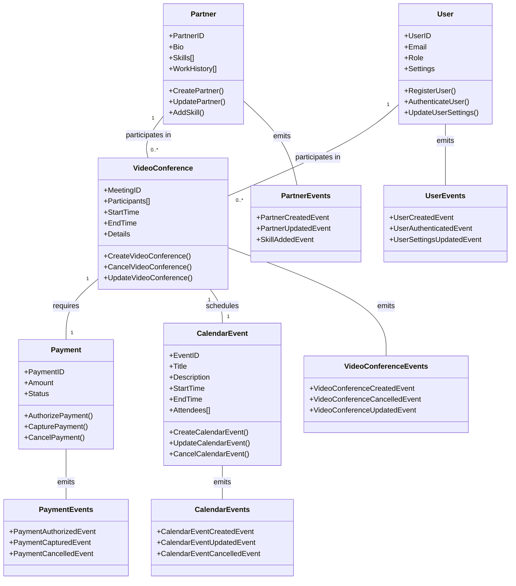

```mermaid
classDiagram
    %% Main Aggregates
    class Partner {
        +PartnerID
        +Bio
        +Skills[]
        +WorkHistory[]
        +CreatePartner()
        +UpdatePartner()
        +AddSkill()
    }
    
    class User {
        +UserID
        +Email
        +Role
        +Settings
        +RegisterUser()
        +AuthenticateUser()
        +UpdateUserSettings()
    }
    
    class VideoConference {
        +MeetingID
        +Participants[]
        +StartTime
        +EndTime
        +Details
        +CreateVideoConference()
        +CancelVideoConference()
        +UpdateVideoConference()
    }
    
    class Payment {
        +PaymentID
        +Amount
        +Status
        +AuthorizePayment()
        +CapturePayment()
        +CancelPayment()
    }
    
    class CalendarEvent {
        +EventID
        +Title
        +Description
        +StartTime
        +EndTime
        +Attendees[]
        +CreateCalendarEvent()
        +UpdateCalendarEvent()
        +CancelCalendarEvent()
    }
    
    %% Events
    class PartnerEvents {
        +PartnerCreatedEvent
        +PartnerUpdatedEvent
        +SkillAddedEvent
    }
    
    class UserEvents {
        +UserCreatedEvent
        +UserAuthenticatedEvent
        +UserSettingsUpdatedEvent
    }
    
    class VideoConferenceEvents {
        +VideoConferenceCreatedEvent
        +VideoConferenceCancelledEvent
        +VideoConferenceUpdatedEvent
    }
    
    class PaymentEvents {
        +PaymentAuthorizedEvent
        +PaymentCapturedEvent
        +PaymentCancelledEvent
    }
    
    class CalendarEvents {
        +CalendarEventCreatedEvent
        +CalendarEventUpdatedEvent
        +CalendarEventCancelledEvent
    }
    
    %% Relationships
    User "1" -- "0..*" VideoConference : participates in
    Partner "1" -- "0..*" VideoConference : participates in
    VideoConference "1" -- "1" Payment : requires
    VideoConference "1" -- "1" CalendarEvent : schedules
    
    Partner -- PartnerEvents : emits
    User -- UserEvents : emits
    VideoConference -- VideoConferenceEvents : emits
    Payment -- PaymentEvents : emits
    CalendarEvent -- CalendarEvents : emits
```