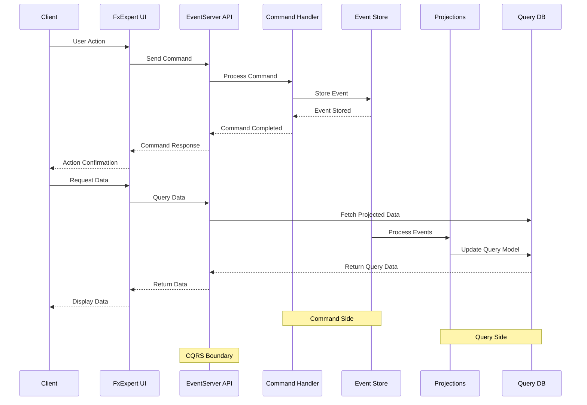

```mermaid
sequenceDiagram
    participant C as Client
    participant UI as FxExpert UI
    participant API as EventServer API
    participant CMD as Command Handler
    participant EVT as Event Store
    participant PROJ as Projections
    participant DB as Query DB
    
    %% Command Path
    C->>UI: User Action
    UI->>API: Send Command
    API->>CMD: Process Command
    CMD->>EVT: Store Event
    EVT-->>CMD: Event Stored
    CMD-->>API: Command Completed
    API-->>UI: Command Response
    UI-->>C: Action Confirmation
    
    %% Query Path
    C->>UI: Request Data
    UI->>API: Query Data
    API->>DB: Fetch Projected Data
    
    %% Projection Update
    EVT->>PROJ: Process Events
    PROJ->>DB: Update Query Model
    
    %% Query Response
    DB-->>API: Return Query Data
    API-->>UI: Return Data
    UI-->>C: Display Data
    
    %% Notes
    Note over CMD,EVT: Command Side
    Note over PROJ,DB: Query Side
    Note over API: CQRS Boundary
```