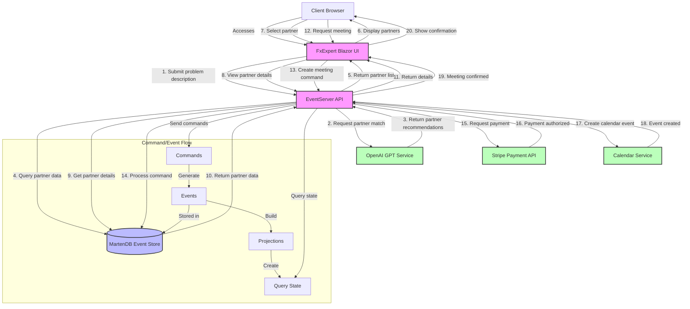

```mermaid
flowchart TD
    %% Main Components
    Client[Client Browser]
    FxExpert[FxExpert Blazor UI]
    EventServer[EventServer API]
    DB[(MartenDB Event Store)]
    GPT[OpenAI GPT Service]
    Stripe[Stripe Payment API]
    Calendar[Calendar Service]
    
    %% Main Flow
    Client -->|Accesses| FxExpert
    FxExpert -->|1. Submit problem description| EventServer
    EventServer -->|2. Request partner match| GPT
    GPT -->|3. Return partner recommendations| EventServer
    EventServer -->|4. Query partner data| DB
    EventServer -->|5. Return partner list| FxExpert
    FxExpert -->|6. Display partners| Client
    
    %% Selection and Booking
    Client -->|7. Select partner| FxExpert
    FxExpert -->|8. View partner details| EventServer
    EventServer -->|9. Get partner details| DB
    DB -->|10. Return partner data| EventServer
    EventServer -->|11. Return details| FxExpert
    
    %% Scheduling
    Client -->|12. Request meeting| FxExpert
    FxExpert -->|13. Create meeting command| EventServer
    EventServer -->|14. Process command| DB
    EventServer -->|15. Request payment| Stripe
    Stripe -->|16. Payment authorized| EventServer
    EventServer -->|17. Create calendar event| Calendar
    Calendar -->|18. Event created| EventServer
    EventServer -->|19. Meeting confirmed| FxExpert
    FxExpert -->|20. Show confirmation| Client
    
    %% Command/Event Flow
    subgraph "Command/Event Flow"
        Commands[Commands]
        Events[Events]
        Projections[Projections]
        QueryState[Query State]
        
        Commands -->|Generate| Events
        Events -->|Stored in| DB
        Events -->|Build| Projections
        Projections -->|Create| QueryState
    end
    
    EventServer -->|Send commands| Commands
    EventServer -->|Query state| QueryState
    
    %% Component Descriptions
    classDef component fill:#f9f,stroke:#333,stroke-width:2px
    classDef storage fill:#bbf,stroke:#333,stroke-width:2px
    classDef external fill:#bfb,stroke:#333,stroke-width:2px
    
    class FxExpert,EventServer component
    class DB storage
    class GPT,Stripe,Calendar external
```