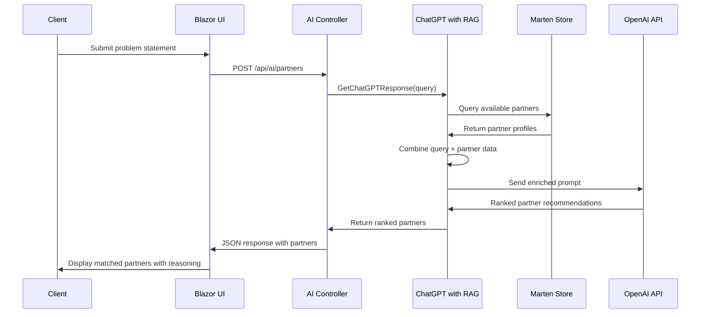

# AI Matching System & Partner Management

> **Last Updated**: 2025-08-08  
> **Version**: 1.0.0

## Overview

FX-Orleans employs a sophisticated AI-powered matching system that uses OpenAI GPT-4 combined with Retrieval-Augmented Generation (RAG) to intelligently match client problem statements with the most suitable partner consultants. The system analyzes natural language descriptions of business challenges and returns ranked partner recommendations based on skills, experience, and availability.

## Architecture

### AI Matching Flow


## Core Components

### 1. ChatGPTWithRAG Service

The main AI service that orchestrates the matching process:

```csharp
public class ChatGPTWithRAG
{
    private readonly IDocumentStore _store;
    
    public async Task<List<Partner>> GetChatGPTResponse(string userQuery)
    {
        // Step 1: Retrieve relevant partners and skills
        var relevantInfo = RetrievePartnersAndSkills(userQuery);
        
        // Step 2: Combine user query with retrieved information
        var combinedInput = $"{relevantInfo}\n\nUser: {userQuery}";
        
        // Step 3: Call OpenAI API with enriched context
        var response = await CallOpenAIAPI(combinedInput);
        
        return response;
    }
}
```

#### Key Features:
- **RAG Implementation**: Retrieves relevant partner data before AI processing
- **Fallback Mechanism**: Returns sample data when OpenAI API is unavailable
- **Error Handling**: Comprehensive exception handling with logging
- **Caching Strategy**: Database-backed partner information caching

### 2. AI Controller

FastEndpoints-based API controller that exposes the matching functionality:

```csharp
[POST("/api/ai/partners")]
public class AIController : Endpoint<AIRequest, List<Partner>>
{
    private readonly ChatGPTWithRAG _chatGPTWithRAG;
    
    public override async Task HandleAsync(AIRequest request, CancellationToken ct)
    {
        var partners = await _chatGPTWithRAG.GetChatGPTResponse(request.ProblemDescription);
        await SendAsync(partners);
    }
}
```

#### API Specification:
- **Endpoint**: `POST /api/ai/partners`
- **Input**: `{ "problemDescription": "string" }`
- **Output**: Array of ranked Partner objects
- **Authentication**: Anonymous (configured for MVP)

### 3. Partner Domain Model

Rich domain model representing consultant partners:

```csharp
public class Partner
{
    public string EmailAddress { get; set; }    // Primary identifier
    public string FirstName { get; set; }
    public string LastName { get; set; }
    public string? Bio { get; set; }
    public string? PhotoUrl { get; set; }
    public string? PrimaryPhone { get; set; }
    
    // Skills and Experience
    public List<PartnerSkill> Skills { get; set; } = new();
    public List<WorkHistory> WorkHistories { get; set; } = new();
    
    // Availability Management
    public int AvailabilityNext30Days { get; set; }
    public bool Active { get; set; }
    public bool LoggedIn { get; set; }
    
    // Audit Fields
    public DateTime CreateDate { get; set; }
    public DateTime? UpdateDate { get; set; }
    public DateTime? LastLogin { get; set; }
    public DateTime? LastLogout { get; set; }
}
```

#### Partner Skills
```csharp
public class PartnerSkill
{
    public string SkillName { get; set; }
    public int YearsOfExperience { get; set; }
    public ExperienceLevel Level { get; set; }  // Novice, Intermediate, Expert
}
```

#### Work History
```csharp
public class WorkHistory
{
    public DateOnly StartDate { get; set; }
    public DateOnly? EndDate { get; set; }
    public string Company { get; set; }
    public string Title { get; set; }
    public string Description { get; set; }
}
```

## AI Prompt Engineering

### System Prompt
The AI uses a carefully crafted system prompt to ensure consistent, high-quality matching:

```
You are a managing partner for a consulting firm that specializes in fractional leadership.
Given this list of partners, use the associated skills and experience to determine which partners
would be best suited to solve the {problem} at hand, in descending order of their relevance to the problem.

Add a rank to each partner. Add a reason why you think the partner is a good fit.
Return a rank-sorted list of all partners as a properly formatted JSON object.
Only return JSON, no additional information is necessary.
Do not hallucinate.
```

### Response Format
The AI returns structured JSON responses:

```json
{
  "ranked_partners": [
    {
      "partnerId": "leo.dangelo@fortiumpartners.com",
      "firstName": "Leo",
      "lastName": "DAngelo",
      "rank": 1,
      "reason": "Expert in AWS architecture and C# development with 30 years of leadership experience. Perfect fit for technical leadership challenges.",
      "skills": [
        {
          "skillName": "leadership",
          "yearsOfExperience": 30,
          "level": "Expert"
        },
        {
          "skillName": "aws",
          "yearsOfExperience": 30,
          "level": "Expert"
        }
      ],
      "workHistories": [
        {
          "company": "Fortium Partners",
          "title": "CTO",
          "description": "Fractional CTO with experience in SaaS financial services"
        }
      ]
    }
  ]
}
```

## RAG Implementation

### Document Retrieval
The RAG system retrieves relevant partner information from the Marten event store:

```csharp
private string RetrievePartnersAndSkills(string query)
{
    var session = _store.QuerySession();
    var partners = session.Query<Partner>()
        .Where(p => p.AvailabilityNext30Days > 0)  // Only available partners
        .ToArray();
    
    return JsonConvert.SerializeObject(partners);
}
```

#### Query Optimization:
- **Availability Filter**: Only includes partners with availability in next 30 days
- **Active Status**: Filters for active partners only
- **Skills Indexing**: Efficient querying of partner skills and experience
- **Full-Text Search**: Future enhancement for semantic skill matching

### Context Enrichment
The system combines user queries with partner data:

```csharp
// Combine user query with retrieved partner information
var combinedInput = $"{relevantInfo}\n\nUser: {userQuery}";

// Example enriched prompt:
// [
//   {
//     "partnerId": "leo.dangelo@fortiumpartners.com",
//     "skills": ["leadership", "aws", "dotnet"],
//     "workHistories": [...]
//   }
// ]
// 
// User: We need help modernizing our legacy .NET application to cloud-native architecture
```

## Partner Management System

### Event Sourcing for Partners

The partner management system uses Event Sourcing with the following events:

#### Core Partner Events
```csharp
// Partner lifecycle events
public record PartnerCreatedEvent(string EmailAddress, string FirstName, string LastName);
public record PartnerLoggedInEvent(string EmailAddress, DateTime LoginTime);
public record PartnerLoggedOutEvent(string EmailAddress, DateTime LogoutTime);

// Profile management events
public record PartnerBioUpdatedEvent(string EmailAddress, string Bio);
public record SetPartnerPhotoUrlEvent(string EmailAddress, string PhotoUrl);
public record SetPartnerPrimaryPhoneEvent(string EmailAddress, string PrimaryPhone);

// Skills and experience events
public record PartnerSkillAddedEvent(string EmailAddress, List<PartnerSkill> Skills);
public record PartnerWorkExperienceAddedEvent(string EmailAddress, List<WorkHistory> WorkHistories);
```

### Partner Projection
The `PartnerProjection` class handles event application:

```csharp
public class PartnerProjection : SingleStreamProjection<Partner, string>
{
    public static Partner Create(PartnerCreatedEvent @event)
    {
        return new Partner
        {
            EmailAddress = @event.EmailAddress,
            FirstName = @event.FirstName,
            LastName = @event.LastName,
            CreateDate = DateTime.Now,
            Active = true
        };
    }
    
    public static Partner Apply(PartnerSkillAddedEvent @event, Partner partner)
    {
        partner.Skills.AddRange(@event.Skills);
        partner.UpdateDate = DateTime.Now;
        return partner;
    }
}
```

## Matching Algorithm Enhancement

### Future Improvements

#### Vector Embeddings
```csharp
// Future implementation for semantic matching
public class SemanticMatchingService
{
    public async Task<List<Partner>> FindSimilarPartners(string problemStatement)
    {
        // Generate embeddings for problem statement
        var problemEmbedding = await GenerateEmbedding(problemStatement);
        
        // Find partners with similar skill embeddings
        var similarPartners = await FindSimilarSkillsVector(problemEmbedding);
        
        return similarPartners;
    }
}
```

#### Machine Learning Integration
```csharp
public class MLMatchingService
{
    public async Task<MatchingScore> CalculateMatchScore(Partner partner, string problem)
    {
        // Historical booking success rates
        var historicalScore = await GetHistoricalSuccessRate(partner, problem);
        
        // Skill relevance scoring
        var skillScore = CalculateSkillRelevance(partner.Skills, problem);
        
        // Availability scoring
        var availabilityScore = CalculateAvailabilityScore(partner);
        
        return new MatchingScore(historicalScore, skillScore, availabilityScore);
    }
}
```

## Performance Optimization

### Caching Strategy
```csharp
public class CachedPartnerService
{
    private readonly IMemoryCache _cache;
    private readonly TimeSpan _cacheExpiry = TimeSpan.FromMinutes(15);
    
    public async Task<List<Partner>> GetAvailablePartners()
    {
        return await _cache.GetOrCreateAsync("available_partners", async entry =>
        {
            entry.AbsoluteExpirationRelativeToNow = _cacheExpiry;
            return await _store.QuerySession()
                .Query<Partner>()
                .Where(p => p.AvailabilityNext30Days > 0)
                .ToListAsync();
        });
    }
}
```

### Database Indexing
```sql
-- PostgreSQL indexes for performance
CREATE INDEX idx_partner_availability ON partners(availability_next30_days) 
WHERE availability_next30_days > 0;

CREATE INDEX idx_partner_skills ON partners USING GIN(skills);
CREATE INDEX idx_partner_active ON partners(active) WHERE active = true;
```

## Testing & Quality Assurance

### Unit Tests
```csharp
public class ChatGPTWithRAGTests
{
    [Test]
    public async Task GetChatGPTResponse_WithValidQuery_ReturnsRankedPartners()
    {
        // Arrange
        var query = "We need help with cloud migration";
        var service = new ChatGPTWithRAG(_mockStore);
        
        // Act
        var result = await service.GetChatGPTResponse(query);
        
        // Assert
        Assert.That(result, Is.Not.Empty);
        Assert.That(result.First().Skills, Contains.Item("aws"));
    }
    
    [Test]
    public async Task GetChatGPTResponse_NoAPIKey_ReturnsSampleData()
    {
        // Test fallback behavior when OpenAI API is unavailable
    }
}
```

### Integration Tests
```csharp
[Test]
public async Task AIController_WithProblemStatement_ReturnsMatchedPartners()
{
    // Arrange
    var request = new AIRequest { ProblemDescription = "Need CTO guidance" };
    
    // Act
    var response = await Client.PostAsync("/api/ai/partners", request);
    
    // Assert
    response.EnsureSuccessStatusCode();
    var partners = await response.Content.ReadAsAsync<List<Partner>>();
    Assert.That(partners, Is.Not.Empty);
}
```

## Configuration & Deployment

### Environment Variables
```bash
# OpenAI Configuration
OPENAI_API_KEY=your-openai-api-key
OPENAI_MODEL=gpt-4o
OPENAI_MAX_TOKENS=4000

# Partner Matching Configuration
PARTNER_CACHE_DURATION_MINUTES=15
MAX_PARTNERS_RETURNED=10
MINIMUM_AVAILABILITY_DAYS=7
```

### Service Registration
```csharp
// Program.cs
builder.Services.AddSingleton<ChatGPTWithRAG>();
builder.Services.AddScoped<IPartnerService, PartnerService>();
builder.Services.AddMemoryCache();

// Configure OpenAI client
builder.Services.Configure<OpenAIOptions>(
    builder.Configuration.GetSection("OpenAI"));
```

## Security Considerations

### API Security
- **Rate Limiting**: Implement rate limiting for AI endpoint to prevent abuse
- **Input Validation**: Sanitize problem statements to prevent prompt injection
- **Cost Management**: Monitor OpenAI API usage and implement cost controls
- **Authentication**: Future enhancement to require authentication for partner matching

### Data Privacy
- **PII Protection**: Ensure partner data privacy in AI processing
- **Audit Logging**: Log all AI matching requests for compliance
- **Data Retention**: Implement data retention policies for AI interactions
- **GDPR Compliance**: Honor data deletion requests for partner information

## Monitoring & Analytics

### Performance Metrics
- AI response time and accuracy
- Partner matching success rates
- OpenAI API usage and costs
- Database query performance
- Cache hit rates

### Business Intelligence
- Most requested skill combinations
- Partner utilization rates
- Matching algorithm effectiveness
- Client booking conversion rates

## Troubleshooting

### Common Issues

#### "No partners returned from AI matching"
- Check OpenAI API key configuration
- Verify partner availability in database
- Review AI prompt and response format
- Check for API rate limiting

#### "AI response format invalid"
- Verify JSON response parsing logic
- Check for OpenAI response format changes
- Review error handling in ChatGPTWithRAG
- Validate partner data structure

#### "Poor matching quality"
- Review and refine system prompt
- Add more partner skills and experience data
- Implement feedback loop for matching quality
- Consider A/B testing different prompts

---

This AI matching system provides intelligent, scalable partner recommendations that continuously improve through usage and feedback, delivering high-quality matches that drive business value for both clients and partners.