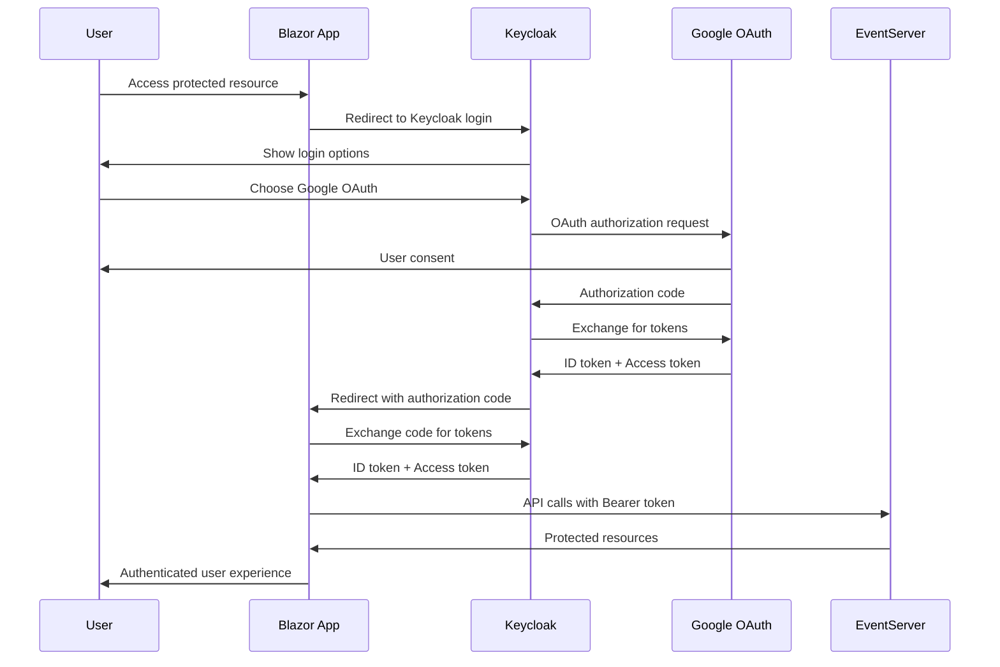

# Authentication & Authorization System

> **Last Updated**: 2025-08-08  
> **Version**: 1.0.0

## Overview

FX-Orleans uses Keycloak as the primary identity provider with OpenID Connect (OIDC) for secure authentication and authorization. The system supports both traditional username/password authentication and Google OAuth for seamless user onboarding.

## Architecture

### Authentication Flow


## Keycloak Configuration

### Realm Setup
**Realm Name**: `fx-orleans`

The Keycloak realm is configured with the following settings:

#### Realm Settings
```json
{
  "realm": "fx-orleans",
  "enabled": true,
  "displayName": "FX Orleans Expert Platform",
  "displayNameHtml": "<div class=\"kc-logo-text\"><span>FX Orleans</span></div>",
  "loginTheme": "keycloak",
  "accountTheme": "keycloak",
  "emailTheme": "keycloak",
  "internationalizationEnabled": true,
  "supportedLocales": ["en", "es", "fr"],
  "defaultLocale": "en"
}
```

#### Client Configuration
**Client ID**: `fx-orleans-client`

```json
{
  "clientId": "fx-orleans-client",
  "name": "FX Orleans Blazor Client",
  "enabled": true,
  "clientAuthenticatorType": "client-secret",
  "secret": "your-client-secret",
  "redirectUris": [
    "https://localhost:5000/signin-oidc",
    "https://your-production-domain.com/signin-oidc"
  ],
  "postLogoutRedirectUris": [
    "https://localhost:5000/signout-callback-oidc",
    "https://your-production-domain.com/signout-callback-oidc"
  ],
  "webOrigins": [
    "https://localhost:5000",
    "https://your-production-domain.com"
  ],
  "protocol": "openid-connect",
  "publicClient": false,
  "frontchannelLogout": true,
  "attributes": {
    "pkce.code.challenge.method": "S256",
    "post.logout.redirect.uris": "+"
  }
}
```

### Google OAuth Integration

#### Identity Provider Configuration
```json
{
  "alias": "google",
  "providerId": "google",
  "enabled": true,
  "trustEmail": true,
  "storeToken": false,
  "addReadTokenRoleOnCreate": false,
  "authenticateByDefault": false,
  "linkOnly": false,
  "firstBrokerLoginFlowAlias": "first broker login",
  "config": {
    "clientId": "your-google-client-id.apps.googleusercontent.com",
    "clientSecret": "your-google-client-secret",
    "hostedDomain": "",
    "useJwksUrl": "true"
  }
}
```

## ASP.NET Core Integration

### Startup Configuration

```csharp
// Program.cs - Authentication Setup
builder.Services
    .AddAuthentication(options =>
    {
        options.DefaultScheme = CookieAuthenticationDefaults.AuthenticationScheme;
        options.DefaultChallengeScheme = OpenIdConnectDefaults.AuthenticationScheme;
    })
    .AddCookie(CookieAuthenticationDefaults.AuthenticationScheme, options =>
    {
        options.Cookie.Name = "FxOrleans.Auth";
        options.Cookie.SameSite = SameSiteMode.Lax;
        options.Cookie.SecurePolicy = CookieSecurePolicy.Always;
        options.Cookie.HttpOnly = true;
        options.ExpireTimeSpan = TimeSpan.FromHours(8);
        options.SlidingExpiration = true;
        options.Events.OnSigningOut = context =>
        {
            context.HttpContext.Response.Redirect("/");
            return Task.CompletedTask;
        };
    })
    .AddOpenIdConnect(OpenIdConnectDefaults.AuthenticationScheme, options =>
    {
        options.Authority = builder.Configuration["Authentication:Keycloak:Authority"];
        options.ClientId = builder.Configuration["Authentication:Keycloak:ClientId"];
        options.ClientSecret = builder.Configuration["Authentication:Keycloak:ClientSecret"];
        options.ResponseType = OpenIdConnectResponseType.Code;
        options.SaveTokens = true;
        options.GetClaimsFromUserInfoEndpoint = true;
        
        // PKCE configuration
        options.UsePkce = true;
        
        // Scopes
        options.Scope.Clear();
        options.Scope.Add("openid");
        options.Scope.Add("profile");
        options.Scope.Add("email");
        
        // Token validation
        options.TokenValidationParameters = new TokenValidationParameters
        {
            NameClaimType = "preferred_username",
            RoleClaimType = "realm_access.roles",
            ValidateIssuer = true,
            ValidateAudience = true,
            ValidateLifetime = true,
            ClockSkew = TimeSpan.FromMinutes(5)
        };
        
        // Event handlers
        options.Events = new OpenIdConnectEvents
        {
            OnRedirectToIdentityProvider = context =>
            {
                // Add custom parameters if needed
                context.ProtocolMessage.SetParameter("kc_idp_hint", "google");
                return Task.CompletedTask;
            },
            OnTokenValidated = async context =>
            {
                // Custom claims processing
                await ProcessUserClaimsAsync(context);
            },
            OnAuthenticationFailed = context =>
            {
                // Log authentication failures
                var logger = context.HttpContext.RequestServices
                    .GetRequiredService<ILogger<Program>>();
                logger.LogError(context.Exception, "Authentication failed");
                
                context.HandleResponse();
                context.Response.Redirect("/auth/error");
                return Task.CompletedTask;
            }
        };
    });

// Authorization policies
builder.Services.AddAuthorization(options =>
{
    options.AddPolicy("RequireAuthenticatedUser", policy =>
        policy.RequireAuthenticatedUser());
        
    options.AddPolicy("PartnerAccess", policy =>
        policy.RequireRole("partner"));
        
    options.AddPolicy("AdminAccess", policy =>
        policy.RequireRole("admin"));
        
    options.AddPolicy("ClientAccess", policy =>
        policy.RequireRole("client", "partner", "admin"));
});
```

## User Roles and Permissions

### Role Definitions

#### Client Role
```json
{
  "name": "client",
  "description": "Standard client user seeking consultation services",
  "composite": false,
  "clientRole": false
}
```

**Permissions**:
- Browse and search partner profiles
- Submit problem statements for AI matching
- Book consultation sessions
- Manage personal profile and preferences
- View booking history and session notes
- Access payment history

#### Partner Role
```json
{
  "name": "partner", 
  "description": "Expert consultant providing services",
  "composite": false,
  "clientRole": false
}
```

**Permissions**:
- Manage availability calendar
- View matched client inquiries
- Accept/decline consultation requests
- Conduct video conferences
- Take and manage session notes
- Access earnings and payout information
- Update professional profile and skills

#### Admin Role
```json
{
  "name": "admin",
  "description": "System administrator with full access",
  "composite": true,
  "clientRole": false,
  "composites": {
    "realm": ["client", "partner"]
  }
}
```

**Permissions**:
- Full system administration
- Partner onboarding and management
- User account management
- System analytics and reporting
- Payment and payout management
- System configuration

### Role Assignment

#### Automatic Role Assignment
New users are automatically assigned the "client" role upon first login. Partner and admin roles must be assigned manually through Keycloak admin interface or API.

#### Role Mapping
```csharp
// Custom role mapping in token validation
private async Task ProcessUserClaimsAsync(TokenValidatedContext context)
{
    var identity = context.Principal.Identity as ClaimsIdentity;
    var userEmail = identity?.FindFirst("email")?.Value;
    
    if (!string.IsNullOrEmpty(userEmail))
    {
        // Check if user exists in our system and assign appropriate roles
        var userService = context.HttpContext.RequestServices
            .GetRequiredService<IUserService>();
            
        var user = await userService.GetUserByEmailAsync(userEmail);
        if (user == null)
        {
            // Create new user with default client role
            await userService.CreateUserAsync(userEmail, "client");
        }
        
        // Add custom claims based on user data
        var roles = await userService.GetUserRolesAsync(userEmail);
        foreach (var role in roles)
        {
            identity.AddClaim(new Claim(ClaimTypes.Role, role));
        }
    }
}
```

## Security Features

### Token Management
- **Access Token Lifetime**: 15 minutes
- **Refresh Token Lifetime**: 24 hours  
- **ID Token**: Contains user profile information
- **Token Refresh**: Automatic refresh before expiration
- **Token Revocation**: Supported for logout scenarios

### Session Security
- **Cookie Security**: HttpOnly, Secure, SameSite=Lax
- **Session Timeout**: 8 hours with sliding expiration
- **CSRF Protection**: Built-in CSRF tokens for all state-changing operations
- **XSS Protection**: Content Security Policy headers

### API Security
```csharp
// EventServer API protection
[Authorize]
[ApiController]
[Route("api/[controller]")]
public class UserController : ControllerBase
{
    [HttpGet("{email}")]
    [Authorize(Policy = "RequireAuthenticatedUser")]
    public async Task<IActionResult> GetUser(string email)
    {
        // Ensure user can only access their own data
        var currentUserEmail = User.FindFirst("email")?.Value;
        if (currentUserEmail != email && !User.IsInRole("admin"))
        {
            return Forbid();
        }
        
        // Implementation...
    }
    
    [HttpPost("profile/{email}")]
    [Authorize(Policy = "ClientAccess")]
    public async Task<IActionResult> UpdateProfile(string email, UpdateUserProfileCommand command)
    {
        // Validation and authorization logic
        // Implementation...
    }
}
```

## Error Handling

### Authentication Errors
- **Invalid Credentials**: Redirected to Keycloak error page
- **Token Expiration**: Automatic redirect to login
- **Network Errors**: Graceful fallback with retry mechanisms
- **Provider Unavailable**: Clear error messages with support contact

### Authorization Errors
- **Access Denied**: Custom 403 error page with navigation
- **Role Missing**: Automatic role request workflow
- **Resource Forbidden**: Clear explanation with upgrade path

## Development Configuration

### User Secrets Setup
```bash
# Navigate to Blazor project
cd src/FxExpert.Blazor/FxExpert.Blazor

# Set Keycloak configuration
dotnet user-secrets set "Authentication:Keycloak:Authority" "http://localhost:8080/realms/fx-orleans"
dotnet user-secrets set "Authentication:Keycloak:ClientId" "fx-orleans-client"
dotnet user-secrets set "Authentication:Keycloak:ClientSecret" "your-client-secret"

# Set Google OAuth configuration
dotnet user-secrets set "Authentication:Google:ClientId" "your-google-client-id"
dotnet user-secrets set "Authentication:Google:ClientSecret" "your-google-client-secret"
```

### Local Testing
```bash
# Start Keycloak with Docker
docker-compose up -d keycloak

# Wait for Keycloak to be ready
curl http://localhost:8080/realms/fx-orleans/.well-known/openid_configuration

# Test authentication flow
curl -X GET "http://localhost:5000/auth/login"
```

## Production Deployment

### Environment Variables
```bash
# Keycloak Configuration
AUTHENTICATION__KEYCLOAK__AUTHORITY=https://keycloak.yourdomain.com/realms/fx-orleans
AUTHENTICATION__KEYCLOAK__CLIENTID=fx-orleans-client
AUTHENTICATION__KEYCLOAK__CLIENTSECRET=production-client-secret

# SSL/TLS Configuration
ASPNETCORE_URLS=https://+:443;http://+:80
ASPNETCORE_HTTPS_PORT=443
ASPNETCORE_ENVIRONMENT=Production

# Cookie Configuration
AUTHENTICATION__COOKIE__DOMAIN=.yourdomain.com
AUTHENTICATION__COOKIE__SECURE=true
AUTHENTICATION__COOKIE__SAMESITE=None
```

### SSL/TLS Requirements
- All authentication flows must use HTTPS in production
- Valid SSL certificate required for cookie security
- Keycloak must be accessible via HTTPS
- Google OAuth requires HTTPS redirect URIs

### High Availability
- **Load Balancer**: Sticky sessions required for authentication state
- **Keycloak Cluster**: Multiple Keycloak instances with shared database
- **Session Store**: Redis or SQL Server for distributed sessions
- **Health Checks**: Authentication endpoint monitoring

## Troubleshooting

### Common Issues

#### "Unable to connect to Keycloak"
```bash
# Check Keycloak status
docker-compose ps keycloak

# Check Keycloak logs
docker-compose logs keycloak

# Verify Keycloak endpoint
curl http://localhost:8080/realms/fx-orleans/.well-known/openid_configuration
```

#### "Invalid redirect URI"
- Verify redirect URIs in Keycloak client configuration
- Ensure HTTPS is used in production environments
- Check for trailing slashes in URI configuration

#### "Token validation failed"
- Verify client secret configuration
- Check system clock synchronization
- Validate Keycloak realm settings

#### "Role access denied"
- Verify user role assignments in Keycloak
- Check role mapping configuration
- Validate authorization policies

### Debug Configuration
```csharp
// Enable detailed authentication logging
builder.Logging.AddFilter("Microsoft.AspNetCore.Authentication", LogLevel.Debug);
builder.Logging.AddFilter("Microsoft.AspNetCore.Authorization", LogLevel.Debug);

// Add authentication event debugging
options.Events.OnTicketReceived = context =>
{
    var logger = context.HttpContext.RequestServices
        .GetRequiredService<ILogger<Program>>();
    logger.LogDebug("Authentication ticket received: {Claims}", 
        string.Join(", ", context.Principal.Claims.Select(c => $"{c.Type}:{c.Value}")));
    return Task.CompletedTask;
};
```

## Security Checklist

### Development
- [ ] Use HTTPS for all authentication flows
- [ ] Validate all user inputs and claims
- [ ] Implement proper session timeout
- [ ] Enable CSRF protection
- [ ] Use secure cookie settings
- [ ] Implement proper error handling
- [ ] Log security events

### Production
- [ ] Use production Keycloak instance with SSL
- [ ] Configure proper CORS policies  
- [ ] Set up monitoring and alerting
- [ ] Implement rate limiting
- [ ] Use secure session storage
- [ ] Enable security headers
- [ ] Regular security audits
- [ ] Keep dependencies updated

---

This authentication system provides enterprise-grade security while maintaining a smooth user experience through modern OAuth flows and comprehensive role-based access control.