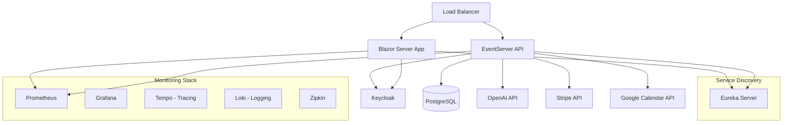

# Deployment & Infrastructure Guide

> **Last Updated**: 2025-08-08  
> **Version**: 1.0.0

## Overview

FX-Orleans supports multiple deployment scenarios from local development to production Kubernetes clusters. The platform uses containerized services with comprehensive monitoring, observability, and security features.

## Architecture Overview

### Service Components


## Local Development Setup

### Prerequisites
- Docker Desktop 4.20+
- .NET 9.0 SDK
- Node.js 18+ (for frontend tooling)
- Git
- Visual Studio Code or Visual Studio 2022

### Quick Start
```bash
# Clone repository
git clone <repository-url>
cd fx-orleans

# Create environment file
cp .env.example .dockerenv

# Start infrastructure services
docker-compose up -d postgres keycloak

# Wait for services to be ready
docker-compose logs -f keycloak

# Build and run applications
just run
```

### Environment Configuration
Create `.dockerenv` file with required environment variables:

```bash
# Database Configuration
POSTGRES_DB=eventserver
POSTGRES_USER=fx_orleans_user
POSTGRES_PASSWORD=fx_orleans_pass

# Keycloak Configuration
KEYCLOAK_ADMIN_PASSWORD=admin123
KC_DB=postgres
KC_DB_URL=jdbc:postgresql://postgres:5432/keycloak
KC_DB_USERNAME=fx_orleans_user
KC_DB_PASSWORD=fx_orleans_pass

# Docker Platform (for Apple Silicon Macs)
DOCKER_PLATFORM=linux/amd64
```

### User Secrets Configuration
```bash
# Navigate to Blazor project
cd src/FxExpert.Blazor/FxExpert.Blazor

# Authentication
dotnet user-secrets set "Authentication:Keycloak:Authority" "http://localhost:8085/realms/fx-orleans"
dotnet user-secrets set "Authentication:Keycloak:ClientId" "fx-orleans-client"
dotnet user-secrets set "Authentication:Keycloak:ClientSecret" "your-client-secret"

# External Services
dotnet user-secrets set "OpenAI:ApiKey" "your-openai-api-key"
dotnet user-secrets set "Stripe:SecretKey" "sk_test_..."
dotnet user-secrets set "Stripe:PublishableKey" "pk_test_..."
dotnet user-secrets set "GoogleCalendar:ServiceAccountKey" "/path/to/service-account.json"
```

## Docker Compose Deployment

### Full Stack with Monitoring
```yaml
# docker-compose.yml
services:
  # Core Services
  postgres:
    container_name: postgres
    image: postgres:latest
    ports:
      - 5432:5432
    env_file:
      - .dockerenv
    volumes:
      - postgres-data:/var/lib/postgresql/data
      - ./docker/postgres/init.sql:/docker-entrypoint-initdb.d/
    networks:
      - data-network

  keycloak:
    container_name: keycloak
    image: quay.io/keycloak/keycloak:latest
    command:
      - start-dev
      - --import-realm
    ports:
      - 8085:8080
    volumes:
      - ./docker/keycloak/:/opt/keycloak/data/import/
    environment:
      KEYCLOAK_ADMIN: admin
      KEYCLOAK_ADMIN_PASSWORD: ${KEYCLOAK_ADMIN_PASSWORD}
      KC_HTTP_ENABLED: true
      KC_HOSTNAME_STRICT: false
      KC_HEALTH_ENABLED: true
    env_file:
      - .dockerenv
    
  eventserver:
    image: eventserver:latest
    build:
      context: .
      dockerfile: src/EventServer/Dockerfile
    ports:
      - "5001:8080"
    environment:
      - ASPNETCORE_ENVIRONMENT=Development
      - ConnectionStrings__EventStore=Host=postgres;Port=5432;Username=fx_orleans_user;Password=fx_orleans_pass;Database=eventserver
      - Authentication__Keycloak__Authority=http://keycloak:8080/realms/fx-orleans
      - OpenAI__ApiKey=${OPENAI_API_KEY}
      - Stripe__SecretKey=${STRIPE_SECRET_KEY}
    depends_on:
      - postgres
      - keycloak
    networks:
      - data-network

  blazor-app:
    image: fx-orleans-blazor:latest
    build:
      context: .
      dockerfile: src/FxExpert.Blazor/FxExpert.Blazor/Dockerfile
    ports:
      - "5000:8080"
    environment:
      - ASPNETCORE_ENVIRONMENT=Development
      - Authentication__Keycloak__Authority=http://keycloak:8080/realms/fx-orleans
      - EventServer__BaseUrl=http://eventserver:8080
    depends_on:
      - eventserver
      - keycloak

  # Monitoring Stack
  prometheus:
    image: prom/prometheus:v2.54.1
    ports:
      - "9091:9090"
    volumes:
      - ./docker/prometheus/prometheus.yml:/etc/prometheus/prometheus.yml:ro
      - prometheus-data:/prometheus
    command:
      - --enable-feature=otlp-write-receiver
      - --web.enable-remote-write-receiver
      - --config.file=/etc/prometheus/prometheus.yml

  grafana:
    image: grafana/grafana:latest
    ports:
      - "3000:3000"
    environment:
      - GF_AUTH_ANONYMOUS_ENABLED=true
      - GF_AUTH_ANONYMOUS_ORG_ROLE=Admin
    volumes:
      - ./docker/grafana/provisioning:/etc/grafana/provisioning:ro
      - grafana-data:/var/lib/grafana

  tempo:
    image: grafana/tempo:latest
    ports:
      - "3200:3200"
      - "4318:4318"
    volumes:
      - ./docker/grafana/tempo.yml:/etc/tempo.yml:ro
      - tempo-data:/tmp/tempo

volumes:
  postgres-data:
  prometheus-data:
  grafana-data:
  tempo-data:

networks:
  data-network:
    driver: bridge
```

### Development Commands
```bash
# Start all services
docker-compose up -d

# View logs
docker-compose logs -f

# Scale services
docker-compose up -d --scale eventserver=3

# Stop all services
docker-compose down

# Remove volumes (clean slate)
docker-compose down -v
```

## Kubernetes Deployment

### Namespace Setup
```yaml
# namespace.yaml
apiVersion: v1
kind: Namespace
metadata:
  name: fx-orleans
  labels:
    name: fx-orleans
---
apiVersion: v1
kind: ServiceAccount
metadata:
  name: fx-orleans-sa
  namespace: fx-orleans
```

### PostgreSQL Deployment
```yaml
# postgresql.yaml
apiVersion: v1
kind: Secret
metadata:
  name: postgres-secret
  namespace: fx-orleans
type: Opaque
stringData:
  POSTGRES_DB: eventserver
  POSTGRES_USER: fx_orleans_user
  POSTGRES_PASSWORD: secure_password_here
---
apiVersion: v1
kind: PersistentVolumeClaim
metadata:
  name: postgres-pvc
  namespace: fx-orleans
spec:
  accessModes:
    - ReadWriteOnce
  resources:
    requests:
      storage: 20Gi
  storageClassName: fast-ssd
---
apiVersion: apps/v1
kind: Deployment
metadata:
  name: postgres
  namespace: fx-orleans
spec:
  replicas: 1
  selector:
    matchLabels:
      app: postgres
  template:
    metadata:
      labels:
        app: postgres
    spec:
      containers:
      - name: postgres
        image: postgres:15-alpine
        ports:
        - containerPort: 5432
        envFrom:
        - secretRef:
            name: postgres-secret
        volumeMounts:
        - name: postgres-storage
          mountPath: /var/lib/postgresql/data
        resources:
          requests:
            memory: "256Mi"
            cpu: "250m"
          limits:
            memory: "1Gi"
            cpu: "500m"
      volumes:
      - name: postgres-storage
        persistentVolumeClaim:
          claimName: postgres-pvc
---
apiVersion: v1
kind: Service
metadata:
  name: postgres
  namespace: fx-orleans
spec:
  selector:
    app: postgres
  ports:
  - port: 5432
    targetPort: 5432
  type: ClusterIP
```

### Keycloak Deployment
```yaml
# keycloak.yaml
apiVersion: v1
kind: Secret
metadata:
  name: keycloak-secret
  namespace: fx-orleans
type: Opaque
stringData:
  KEYCLOAK_ADMIN: admin
  KEYCLOAK_ADMIN_PASSWORD: secure_admin_password_here
  KC_DB_URL: jdbc:postgresql://postgres:5432/keycloak
  KC_DB_USERNAME: fx_orleans_user
  KC_DB_PASSWORD: secure_password_here
---
apiVersion: apps/v1
kind: Deployment
metadata:
  name: keycloak
  namespace: fx-orleans
spec:
  replicas: 2
  selector:
    matchLabels:
      app: keycloak
  template:
    metadata:
      labels:
        app: keycloak
    spec:
      containers:
      - name: keycloak
        image: quay.io/keycloak/keycloak:latest
        args:
          - start
          - --hostname-strict=false
          - --hostname-strict-https=false
          - --http-enabled=true
          - --import-realm
        ports:
        - containerPort: 8080
        envFrom:
        - secretRef:
            name: keycloak-secret
        env:
        - name: KC_HTTP_PORT
          value: "8080"
        - name: KC_HEALTH_ENABLED
          value: "true"
        - name: KC_METRICS_ENABLED
          value: "true"
        - name: KC_DB
          value: postgres
        volumeMounts:
        - name: realm-import
          mountPath: /opt/keycloak/data/import
        resources:
          requests:
            memory: "512Mi"
            cpu: "500m"
          limits:
            memory: "1Gi"
            cpu: "1000m"
        readinessProbe:
          httpGet:
            path: /health/ready
            port: 8080
          initialDelaySeconds: 60
          periodSeconds: 10
        livenessProbe:
          httpGet:
            path: /health/live
            port: 8080
          initialDelaySeconds: 120
          periodSeconds: 30
      volumes:
      - name: realm-import
        configMap:
          name: keycloak-realm-config
---
apiVersion: v1
kind: Service
metadata:
  name: keycloak
  namespace: fx-orleans
spec:
  selector:
    app: keycloak
  ports:
  - name: http
    port: 8080
    targetPort: 8080
  type: ClusterIP
---
apiVersion: v1
kind: ConfigMap
metadata:
  name: keycloak-realm-config
  namespace: fx-orleans
data:
  realm-export.json: |
    {
      "realm": "fx-orleans",
      "enabled": true,
      "clients": [
        {
          "clientId": "fx-orleans-client",
          "enabled": true,
          "redirectUris": ["https://fx-orleans.com/signin-oidc"],
          "webOrigins": ["https://fx-orleans.com"]
        }
      ]
    }
```

### EventServer Deployment
```yaml
# eventserver.yaml
apiVersion: v1
kind: Secret
metadata:
  name: eventserver-secret
  namespace: fx-orleans
type: Opaque
stringData:
  ConnectionStrings__EventStore: Host=postgres;Port=5432;Username=fx_orleans_user;Password=secure_password_here;Database=eventserver
  OpenAI__ApiKey: your-openai-api-key
  Stripe__SecretKey: your-stripe-secret-key
  GoogleCalendar__ServiceAccountKey: |
    {
      "type": "service_account",
      "project_id": "your-project",
      // ... rest of service account JSON
    }
---
apiVersion: apps/v1
kind: Deployment
metadata:
  name: eventserver
  namespace: fx-orleans
spec:
  replicas: 3
  selector:
    matchLabels:
      app: eventserver
  template:
    metadata:
      labels:
        app: eventserver
    spec:
      serviceAccountName: fx-orleans-sa
      containers:
      - name: eventserver
        image: fx-orleans/eventserver:latest
        ports:
        - containerPort: 8080
        envFrom:
        - secretRef:
            name: eventserver-secret
        env:
        - name: ASPNETCORE_ENVIRONMENT
          value: "Production"
        - name: ASPNETCORE_URLS
          value: "http://+:8080"
        resources:
          requests:
            memory: "256Mi"
            cpu: "250m"
          limits:
            memory: "512Mi"
            cpu: "500m"
        readinessProbe:
          httpGet:
            path: /health
            port: 8080
          initialDelaySeconds: 30
          periodSeconds: 10
        livenessProbe:
          httpGet:
            path: /health
            port: 8080
          initialDelaySeconds: 60
          periodSeconds: 30
---
apiVersion: v1
kind: Service
metadata:
  name: eventserver
  namespace: fx-orleans
spec:
  selector:
    app: eventserver
  ports:
  - port: 80
    targetPort: 8080
  type: ClusterIP
```

### Blazor App Deployment
```yaml
# blazor-app.yaml
apiVersion: v1
kind: ConfigMap
metadata:
  name: blazor-config
  namespace: fx-orleans
data:
  appsettings.Production.json: |
    {
      "Authentication": {
        "Keycloak": {
          "Authority": "https://auth.fx-orleans.com/realms/fx-orleans",
          "ClientId": "fx-orleans-client"
        }
      },
      "EventServer": {
        "BaseUrl": "https://api.fx-orleans.com"
      },
      "Stripe": {
        "PublishableKey": "pk_live_..."
      },
      "Logging": {
        "LogLevel": {
          "Default": "Information",
          "Microsoft.AspNetCore": "Warning"
        }
      }
    }
---
apiVersion: apps/v1
kind: Deployment
metadata:
  name: blazor-app
  namespace: fx-orleans
spec:
  replicas: 2
  selector:
    matchLabels:
      app: blazor-app
  template:
    metadata:
      labels:
        app: blazor-app
    spec:
      containers:
      - name: blazor-app
        image: fx-orleans/blazor-app:latest
        ports:
        - containerPort: 8080
        env:
        - name: ASPNETCORE_ENVIRONMENT
          value: "Production"
        - name: ASPNETCORE_URLS
          value: "http://+:8080"
        volumeMounts:
        - name: config
          mountPath: /app/appsettings.Production.json
          subPath: appsettings.Production.json
        resources:
          requests:
            memory: "128Mi"
            cpu: "100m"
          limits:
            memory: "256Mi"
            cpu: "200m"
      volumes:
      - name: config
        configMap:
          name: blazor-config
---
apiVersion: v1
kind: Service
metadata:
  name: blazor-app
  namespace: fx-orleans
spec:
  selector:
    app: blazor-app
  ports:
  - port: 80
    targetPort: 8080
  type: ClusterIP
```

### Ingress Configuration
```yaml
# ingress.yaml
apiVersion: networking.k8s.io/v1
kind: Ingress
metadata:
  name: fx-orleans-ingress
  namespace: fx-orleans
  annotations:
    kubernetes.io/ingress.class: nginx
    cert-manager.io/cluster-issuer: letsencrypt-prod
    nginx.ingress.kubernetes.io/ssl-redirect: "true"
    nginx.ingress.kubernetes.io/force-ssl-redirect: "true"
    nginx.ingress.kubernetes.io/proxy-buffer-size: "16k"
spec:
  tls:
  - hosts:
    - fx-orleans.com
    - api.fx-orleans.com
    - auth.fx-orleans.com
    secretName: fx-orleans-tls
  rules:
  - host: fx-orleans.com
    http:
      paths:
      - path: /
        pathType: Prefix
        backend:
          service:
            name: blazor-app
            port:
              number: 80
  - host: api.fx-orleans.com
    http:
      paths:
      - path: /
        pathType: Prefix
        backend:
          service:
            name: eventserver
            port:
              number: 80
  - host: auth.fx-orleans.com
    http:
      paths:
      - path: /
        pathType: Prefix
        backend:
          service:
            name: keycloak
            port:
              number: 8080
```

## Monitoring & Observability

### Prometheus Configuration
```yaml
# monitoring/prometheus.yaml
global:
  scrape_interval: 15s
  evaluation_interval: 15s

rule_files:
  - "fx-orleans-rules.yml"

scrape_configs:
  - job_name: 'fx-orleans-eventserver'
    static_configs:
      - targets: ['eventserver:8080']
    metrics_path: '/metrics'
    scrape_interval: 5s

  - job_name: 'fx-orleans-blazor'
    static_configs:
      - targets: ['blazor-app:8080']
    metrics_path: '/metrics'
    scrape_interval: 5s

  - job_name: 'keycloak'
    static_configs:
      - targets: ['keycloak:8080']
    metrics_path: '/metrics'
    scrape_interval: 30s

  - job_name: 'postgres-exporter'
    static_configs:
      - targets: ['postgres-exporter:9187']
```

### Grafana Dashboards
Pre-configured dashboards for:
- **Application Metrics**: Request rates, response times, error rates
- **Business Metrics**: Partner matching success rates, payment processing
- **Infrastructure**: CPU, memory, disk usage
- **Database**: Query performance, connection pooling
- **Authentication**: Login success rates, token refresh patterns

### Alerting Rules
```yaml
# alerting-rules.yml
groups:
- name: fx-orleans-alerts
  rules:
  - alert: HighErrorRate
    expr: rate(http_requests_total{status=~"5.."}[5m]) > 0.1
    for: 2m
    labels:
      severity: warning
    annotations:
      summary: "High error rate detected"

  - alert: DatabaseConnectionFailure
    expr: up{job="postgres"} == 0
    for: 1m
    labels:
      severity: critical
    annotations:
      summary: "Database connection failure"

  - alert: PaymentProcessingDown
    expr: up{job="eventserver", endpoint="/payments/health"} == 0
    for: 30s
    labels:
      severity: critical
    annotations:
      summary: "Payment processing endpoint is down"
```

## CI/CD Pipeline

### GitHub Actions Workflow
```yaml
# .github/workflows/deploy.yml
name: Build and Deploy

on:
  push:
    branches: [main]
  pull_request:
    branches: [main]

jobs:
  test:
    runs-on: ubuntu-latest
    steps:
    - uses: actions/checkout@v4
    
    - name: Setup .NET
      uses: actions/setup-dotnet@v4
      with:
        dotnet-version: '9.0.x'
        
    - name: Restore dependencies
      run: dotnet restore
      
    - name: Build
      run: dotnet build --no-restore
      
    - name: Test
      run: dotnet test --no-build --verbosity normal
      
    - name: E2E Tests
      run: |
        docker-compose up -d postgres keycloak
        sleep 30
        cd tests/FxExpert.E2E.Tests
        dotnet test

  build-and-push:
    needs: test
    runs-on: ubuntu-latest
    if: github.ref == 'refs/heads/main'
    
    steps:
    - uses: actions/checkout@v4
    
    - name: Build and push EventServer
      uses: docker/build-push-action@v5
      with:
        context: .
        file: ./src/EventServer/Dockerfile
        push: true
        tags: |
          ghcr.io/fx-orleans/eventserver:latest
          ghcr.io/fx-orleans/eventserver:${{ github.sha }}
          
    - name: Build and push Blazor App
      uses: docker/build-push-action@v5
      with:
        context: .
        file: ./src/FxExpert.Blazor/FxExpert.Blazor/Dockerfile
        push: true
        tags: |
          ghcr.io/fx-orleans/blazor-app:latest
          ghcr.io/fx-orleans/blazor-app:${{ github.sha }}

  deploy:
    needs: build-and-push
    runs-on: ubuntu-latest
    if: github.ref == 'refs/heads/main'
    
    steps:
    - uses: actions/checkout@v4
    
    - name: Configure kubectl
      uses: azure/setup-kubectl@v3
      with:
        version: 'latest'
        
    - name: Deploy to Kubernetes
      run: |
        echo "${{ secrets.KUBE_CONFIG }}" | base64 -d > kubeconfig
        export KUBECONFIG=kubeconfig
        
        # Update image tags
        kubectl set image deployment/eventserver eventserver=ghcr.io/fx-orleans/eventserver:${{ github.sha }} -n fx-orleans
        kubectl set image deployment/blazor-app blazor-app=ghcr.io/fx-orleans/blazor-app:${{ github.sha }} -n fx-orleans
        
        # Wait for rollout
        kubectl rollout status deployment/eventserver -n fx-orleans
        kubectl rollout status deployment/blazor-app -n fx-orleans
```

## Security Configuration

### Network Policies
```yaml
# security/network-policies.yaml
apiVersion: networking.k8s.io/v1
kind: NetworkPolicy
metadata:
  name: fx-orleans-network-policy
  namespace: fx-orleans
spec:
  podSelector: {}
  policyTypes:
  - Ingress
  - Egress
  ingress:
  - from:
    - namespaceSelector:
        matchLabels:
          name: ingress-nginx
    - podSelector:
        matchLabels:
          app: fx-orleans
  egress:
  - to:
    - podSelector:
        matchLabels:
          app: postgres
    ports:
    - protocol: TCP
      port: 5432
  - to: []
    ports:
    - protocol: TCP
      port: 443
    - protocol: TCP
      port: 80
```

### Pod Security Standards
```yaml
# security/pod-security.yaml
apiVersion: v1
kind: Namespace
metadata:
  name: fx-orleans
  labels:
    pod-security.kubernetes.io/enforce: restricted
    pod-security.kubernetes.io/audit: restricted
    pod-security.kubernetes.io/warn: restricted
```

### RBAC Configuration
```yaml
# security/rbac.yaml
apiVersion: rbac.authorization.k8s.io/v1
kind: Role
metadata:
  name: fx-orleans-role
  namespace: fx-orleans
rules:
- apiGroups: [""]
  resources: ["secrets", "configmaps"]
  verbs: ["get", "list"]
- apiGroups: ["apps"]
  resources: ["deployments"]
  verbs: ["get", "list", "watch"]
---
apiVersion: rbac.authorization.k8s.io/v1
kind: RoleBinding
metadata:
  name: fx-orleans-role-binding
  namespace: fx-orleans
subjects:
- kind: ServiceAccount
  name: fx-orleans-sa
  namespace: fx-orleans
roleRef:
  kind: Role
  name: fx-orleans-role
  apiGroup: rbac.authorization.k8s.io
```

## Backup & Disaster Recovery

### Database Backup
```yaml
# backup/postgres-backup.yaml
apiVersion: batch/v1
kind: CronJob
metadata:
  name: postgres-backup
  namespace: fx-orleans
spec:
  schedule: "0 2 * * *"  # Daily at 2 AM
  jobTemplate:
    spec:
      template:
        spec:
          containers:
          - name: postgres-backup
            image: postgres:15-alpine
            command:
            - /bin/bash
            - -c
            - |
              pg_dump -h postgres -U fx_orleans_user -d eventserver > /backup/fx-orleans-$(date +%Y%m%d).sql
              # Upload to S3 or other backup storage
            env:
            - name: PGPASSWORD
              valueFrom:
                secretKeyRef:
                  name: postgres-secret
                  key: POSTGRES_PASSWORD
            volumeMounts:
            - name: backup-storage
              mountPath: /backup
          volumes:
          - name: backup-storage
            persistentVolumeClaim:
              claimName: backup-pvc
          restartPolicy: OnFailure
```

### Keycloak Backup
```bash
# Backup Keycloak realm configuration
kubectl exec -n fx-orleans deployment/keycloak -- /opt/keycloak/bin/kc.sh export \
  --realm fx-orleans \
  --file /tmp/realm-backup.json

kubectl cp fx-orleans/keycloak-pod:/tmp/realm-backup.json ./keycloak-backup.json
```

## Performance Tuning

### Resource Allocation
```yaml
# Recommended resource allocations for production
EventServer:
  requests:
    memory: "512Mi"
    cpu: "500m"
  limits:
    memory: "1Gi"
    cpu: "1000m"

Blazor App:
  requests:
    memory: "256Mi"
    cpu: "250m"
  limits:
    memory: "512Mi"
    cpu: "500m"

PostgreSQL:
  requests:
    memory: "1Gi"
    cpu: "500m"
  limits:
    memory: "2Gi"
    cpu: "1000m"

Keycloak:
  requests:
    memory: "1Gi"
    cpu: "500m"
  limits:
    memory: "2Gi"
    cpu: "1000m"
```

### Horizontal Pod Autoscaling
```yaml
# autoscaling/hpa.yaml
apiVersion: autoscaling/v2
kind: HorizontalPodAutoscaler
metadata:
  name: eventserver-hpa
  namespace: fx-orleans
spec:
  scaleTargetRef:
    apiVersion: apps/v1
    kind: Deployment
    name: eventserver
  minReplicas: 2
  maxReplicas: 10
  metrics:
  - type: Resource
    resource:
      name: cpu
      target:
        type: Utilization
        averageUtilization: 70
  - type: Resource
    resource:
      name: memory
      target:
        type: Utilization
        averageUtilization: 80
```

## Troubleshooting

### Common Issues

#### Database Connection Issues
```bash
# Check database connectivity
kubectl exec -n fx-orleans deployment/eventserver -- \
  nc -zv postgres 5432

# Check database logs
kubectl logs -n fx-orleans deployment/postgres

# Verify connection string
kubectl get secret -n fx-orleans eventserver-secret -o yaml
```

#### Authentication Issues
```bash
# Check Keycloak health
kubectl get pods -n fx-orleans -l app=keycloak
kubectl logs -n fx-orleans deployment/keycloak

# Test authentication endpoint
curl -k https://auth.fx-orleans.com/realms/fx-orleans/.well-known/openid_configuration
```

#### Performance Issues
```bash
# Check resource usage
kubectl top pods -n fx-orleans

# Scale up services
kubectl scale deployment/eventserver --replicas=5 -n fx-orleans

# Check metrics
kubectl port-forward -n fx-orleans svc/prometheus 9090:9090
# Open http://localhost:9090
```

### Health Check Endpoints
- **EventServer**: `GET /health`
- **Blazor App**: `GET /health`
- **Keycloak**: `GET /health`
- **PostgreSQL**: Connection test via EventServer

### Monitoring Dashboards
- **Grafana**: `http://grafana.fx-orleans.com`
- **Prometheus**: `http://prometheus.fx-orleans.com`
- **Jaeger**: `http://jaeger.fx-orleans.com`

---

This comprehensive deployment guide provides everything needed to deploy FX-Orleans from local development to production Kubernetes environments with proper monitoring, security, and disaster recovery capabilities.