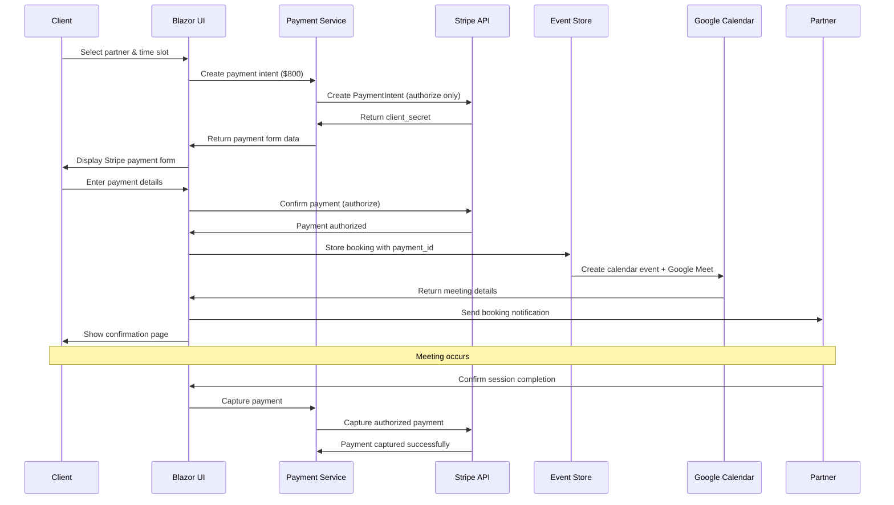

# Payment Integration & Booking Flow

> **Last Updated**: 2025-08-08  
> **Version**: 1.0.0

## Overview

FX-Orleans implements a comprehensive payment and booking system using Stripe for payment processing and Google Calendar for meeting management. The system follows an authorize-first, capture-later payment model to ensure funds are secured before meetings are scheduled, while providing full refund capabilities for cancelled sessions.

## Payment Architecture

### Payment Flow Diagram


## Core Components

### 1. Payment Service (EventServer)

Server-side Stripe integration handling payment processing:

```csharp
public class PaymentService : IPaymentService
{
    private readonly PaymentIntentService _paymentIntentService;

    public async Task<string> CreatePaymentIntentAsync(decimal amount, string currency)
    {
        var options = new PaymentIntentCreateOptions
        {
            Amount = (long)(amount * 100), // Convert to cents
            Currency = currency.ToLower(),
            CaptureMethod = "manual", // Authorize only, capture later
            AutomaticPaymentMethods = new PaymentIntentAutomaticPaymentMethodsOptions
            {
                Enabled = true,
            },
        };

        var paymentIntent = await _paymentIntentService.CreateAsync(options);
        return paymentIntent.Id;
    }

    public async Task CapturePaymentAsync(string paymentIntentId)
    {
        await _paymentIntentService.CaptureAsync(paymentIntentId);
    }
}
```

#### Key Features:
- **Authorize-First Model**: Reserves funds without immediate capture
- **Multiple Payment Methods**: Credit cards, Apple Pay, Google Pay
- **Currency Support**: Primary USD with multi-currency capability
- **Error Handling**: Comprehensive exception handling with retry logic

### 2. Stripe Payment Service (Client)

Client-side JavaScript interop for secure payment processing:

```csharp
public class StripePaymentService : IStripePaymentService
{
    private readonly IJSRuntime _jsRuntime;

    public async Task<PaymentResult> ConfirmPaymentAsync(string returnUrl)
    {
        var result = await _jsRuntime.InvokeAsync<JsonElement>(
            "stripeInterop.confirmPayment", returnUrl);
        
        return new PaymentResult
        {
            Success = result.GetProperty("success").GetBoolean(),
            PaymentIntentId = result.TryGetProperty("paymentIntentId", out var idProp) 
                ? idProp.GetString() : null,
            Status = result.TryGetProperty("status", out var statusProp) 
                ? statusProp.GetString() : null
        };
    }
}
```

### 3. JavaScript Stripe Integration

Secure client-side payment processing:

```javascript
window.stripeInterop = {
    initialize: function (publishableKey) {
        stripe = Stripe(publishableKey);
        return true;
    },

    createPaymentForm: function (elementId, clientSecret) {
        elements = stripe.elements({
            clientSecret: clientSecret,
            appearance: {
                theme: 'stripe',
                variables: {
                    colorPrimary: '#1976d2',
                    fontFamily: 'Roboto, sans-serif'
                }
            }
        });

        paymentElement = elements.create('payment');
        paymentElement.mount(`#${elementId}`);
        return true;
    },

    confirmPayment: async function (returnUrl) {
        const result = await stripe.confirmPayment({
            elements,
            confirmParams: { return_url: returnUrl },
            redirect: 'if_required'
        });

        return {
            success: !result.error,
            paymentIntentId: result.paymentIntent?.id,
            status: result.paymentIntent?.status
        };
    }
};
```

## Booking System

### 1. Partner Selection Process

The booking flow begins with AI-powered partner matching:

```csharp
// Home.razor - Problem statement submission
private async Task SubmitProblemStatement()
{
    var request = new AIRequest { ProblemDescription = problemStatement };
    var response = await Http.PostAsJsonAsync("/api/ai/partners", request);
    var matchedPartners = await response.Content.ReadFromJsonAsync<List<Partner>>();
    
    // Display ranked partners with booking options
    NavigationManager.NavigateTo($"/partner-selection?partners={encodedPartners}");
}
```

### 2. Calendar Integration

Google Calendar integration for availability and meeting management:

```csharp
public class GoogleCalendarService
{
    private readonly CalendarService _service;

    public Event CreateEvent(string calendarId, Event newEvent)
    {
        var request = _service.Events.Insert(newEvent, calendarId);
        request.SendUpdates = EventsResource.InsertRequest.SendUpdatesEnum.ExternalOnly;
        request.SendNotifications = true;
        request.ConferenceDataVersion = 1; // Enable Google Meet
        return request.Execute();
    }

    public Events GetCalendarEvents(string calendarId)
    {
        var request = _service.Events.List(calendarId);
        request.TimeMinDateTimeOffset = DateTime.Now;
        request.ShowDeleted = false;
        request.SingleEvents = true;
        request.MaxResults = 40;
        request.OrderBy = EventsResource.ListRequest.OrderByEnum.StartTime;
        
        return request.Execute();
    }
}
```

#### Google Meet Integration:
- **Automatic Link Generation**: Each booking creates a Google Meet link
- **Calendar Invitations**: Both client and partner receive calendar invites
- **Email Notifications**: Automated confirmation and reminder emails
- **Time Zone Handling**: Proper time zone conversion for global users

### 3. Booking State Management

Event sourcing for booking lifecycle management:

```csharp
// Booking Events
public record ConsultationRequestedEvent(
    string ClientEmail, 
    string PartnerEmail, 
    DateTime RequestedDateTime, 
    string ProblemDescription
);

public record PaymentAuthorizedEvent(
    string BookingId, 
    string PaymentIntentId, 
    decimal Amount, 
    string Currency
);

public record ConsultationScheduledEvent(
    string BookingId, 
    string CalendarEventId, 
    string GoogleMeetLink, 
    DateTime ScheduledDateTime
);

public record ConsultationConfirmedEvent(
    string BookingId, 
    DateTime ConfirmationDateTime, 
    string ConfirmationEmailSent
);
```

## Payment Models & Configuration

### Payment Data Models

```csharp
public class PaymentResult
{
    public bool Success { get; set; }
    public string? Error { get; set; }
    public string? PaymentIntentId { get; set; }
    public string? Status { get; set; }
}

public class PaymentMethodResult
{
    public bool Success { get; set; }
    public string? Error { get; set; }
    public string? PaymentMethodId { get; set; }
}

public class BookingPaymentRequest
{
    public string PartnerEmail { get; set; }
    public DateTime RequestedDateTime { get; set; }
    public string ClientEmail { get; set; }
    public string ProblemDescription { get; set; }
    public decimal Amount { get; set; } = 800.00m;
    public string Currency { get; set; } = "USD";
}
```

### Pricing Configuration

```csharp
public class PaymentConfiguration
{
    public const decimal StandardSessionPrice = 800.00m;
    public const string DefaultCurrency = "USD";
    public const int SessionDurationMinutes = 60;
    
    // Revenue sharing
    public const decimal PartnerSharePercentage = 0.80m; // 80%
    public const decimal PlatformSharePercentage = 0.20m; // 20%
    
    // Payment timing
    public static readonly TimeSpan AuthorizationValidityPeriod = TimeSpan.FromDays(7);
    public static readonly TimeSpan CaptureDelayAfterSession = TimeSpan.FromMinutes(30);
}
```

## Event Sourcing Implementation

### Payment Aggregate

```csharp
public class Payment
{
    public string Id { get; set; }
    public string BookingId { get; set; }
    public string ClientEmail { get; set; }
    public string PartnerEmail { get; set; }
    
    // Payment details
    public string PaymentIntentId { get; set; }
    public decimal Amount { get; set; }
    public string Currency { get; set; }
    
    // Status tracking
    public PaymentStatus Status { get; set; }
    public DateTime CreatedAt { get; set; }
    public DateTime? AuthorizedAt { get; set; }
    public DateTime? CapturedAt { get; set; }
    public DateTime? RefundedAt { get; set; }
    
    // Session details
    public DateTime ScheduledDateTime { get; set; }
    public string? GoogleMeetLink { get; set; }
    public string? CalendarEventId { get; set; }
}

public enum PaymentStatus
{
    Created,
    Authorized,
    Confirmed,
    Captured,
    Refunded,
    Failed,
    Cancelled
}
```

### Payment Projection

```csharp
public class PaymentProjection : SingleStreamProjection<Payment, string>
{
    public static Payment Create(PaymentAuthorizedEvent @event)
    {
        return new Payment
        {
            Id = @event.PaymentIntentId,
            BookingId = @event.BookingId,
            PaymentIntentId = @event.PaymentIntentId,
            Amount = @event.Amount,
            Currency = @event.Currency,
            Status = PaymentStatus.Authorized,
            AuthorizedAt = DateTime.UtcNow
        };
    }
    
    public static Payment Apply(PaymentCapturedEvent @event, Payment payment)
    {
        payment.Status = PaymentStatus.Captured;
        payment.CapturedAt = @event.CapturedAt;
        return payment;
    }
}
```

## User Interface Components

### 1. Partner Selection Page

```razor
@page "/partner-info/{partnerId}"

<MudContainer>
    <MudCard>
        <MudCardContent>
            <MudText Typo="Typo.h4">@partner.FirstName @partner.LastName</MudText>
            <MudText Typo="Typo.body1">@partner.Bio</MudText>
            
            <!-- Skills Display -->
            <MudChipSet>
                @foreach (var skill in partner.Skills.Take(5))
                {
                    <MudChip Color="Color.Primary">@skill.SkillName</MudChip>
                }
            </MudChipSet>
            
            <!-- Booking Button -->
            <MudButton Variant="Variant.Filled" 
                      Color="Color.Primary" 
                      OnClick="@(() => NavigateToPayment())">
                Book Session - $800
            </MudButton>
        </MudCardContent>
    </MudCard>
</MudContainer>
```

### 2. Payment Form Component

```razor
<MudCard Class="pa-6">
    <MudCardContent>
        <MudText Typo="Typo.h5" Class="mb-4">Complete Your Booking</MudText>
        
        <!-- Session Details -->
        <MudPaper Class="pa-4 mb-4" Elevation="1">
            <MudText><strong>Partner:</strong> @PartnerName</MudText>
            <MudText><strong>Date & Time:</strong> @SessionDateTime.ToString("MMM dd, yyyy at hh:mm tt")</MudText>
            <MudText><strong>Duration:</strong> 60 minutes</MudText>
            <MudText Typo="Typo.h6" Color="Color.Primary"><strong>Total: $800.00</strong></MudText>
        </MudPaper>
        
        <!-- Stripe Payment Element -->
        <div id="payment-element" class="mb-4"></div>
        
        <!-- Payment Actions -->
        <MudStack Row Justify="Justify.SpaceBetween">
            <MudButton Variant="Variant.Outlined" OnClick="Cancel">Cancel</MudButton>
            <MudButton Variant="Variant.Filled" 
                      Color="Color.Primary" 
                      OnClick="ProcessPayment"
                      Disabled="@isProcessing">
                @if (isProcessing)
                {
                    <MudProgressCircular Size="Size.Small" Indeterminate="true" />
                    <MudText>Processing...</MudText>
                }
                else
                {
                    <MudText>Complete Booking</MudText>
                }
            </MudButton>
        </MudStack>
    </MudCardContent>
</MudCard>
```

### 3. Confirmation Page

```razor
@page "/confirmation/{bookingId}"

<MudContainer>
    <MudCard Class="pa-6">
        <MudCardContent>
            <MudStack AlignItems="AlignItems.Center" Spacing="4">
                <MudIcon Icon="@Icons.Material.Filled.CheckCircle" 
                        Color="Color.Success" 
                        Size="Size.Large" />
                
                <MudText Typo="Typo.h4" Align="Align.Center">
                    Booking Confirmed!
                </MudText>
                
                <MudPaper Class="pa-4" Elevation="2" Width="100%">
                    <MudText><strong>Session ID:</strong> @booking.Id</MudText>
                    <MudText><strong>Partner:</strong> @booking.PartnerName</MudText>
                    <MudText><strong>Date & Time:</strong> @booking.ScheduledDateTime</MudText>
                    <MudText><strong>Google Meet Link:</strong></MudText>
                    <MudLink Href="@booking.GoogleMeetLink" Target="_blank">
                        Join Meeting
                    </MudLink>
                </MudPaper>
                
                <MudAlert Severity="Severity.Info">
                    You'll receive calendar invitations and reminder emails.
                    Payment will be processed after your successful session.
                </MudAlert>
            </MudStack>
        </MudCardContent>
    </MudCard>
</MudContainer>
```

## Security Implementation

### PCI Compliance
- **No Card Data Storage**: All payment data handled by Stripe
- **HTTPS Enforcement**: All payment pages require SSL/TLS
- **CSP Headers**: Content Security Policy for XSS protection
- **Token-Based Security**: Client-side tokens with server validation

### Payment Security
```csharp
// Secure payment intent creation
[Authorize]
[HttpPost("create-payment-intent")]
public async Task<IActionResult> CreatePaymentIntent([FromBody] BookingRequest request)
{
    // Validate user authorization
    var userEmail = User.FindFirst("email")?.Value;
    if (userEmail != request.ClientEmail && !User.IsInRole("admin"))
    {
        return Forbid();
    }
    
    // Validate partner availability
    var partner = await GetPartnerAsync(request.PartnerEmail);
    if (!IsPartnerAvailable(partner, request.RequestedDateTime))
    {
        return BadRequest("Partner not available at requested time");
    }
    
    // Create payment intent
    var paymentIntentId = await _paymentService.CreatePaymentIntentAsync(
        request.Amount, request.Currency);
    
    return Ok(new { PaymentIntentId = paymentIntentId });
}
```

### Fraud Prevention
- **Address Verification**: AVS checks for card transactions
- **CVC Verification**: Card verification code validation  
- **Rate Limiting**: Prevent payment spam and abuse
- **IP Geolocation**: Flag suspicious geographic patterns
- **Device Fingerprinting**: Detect unusual payment devices

## Error Handling & Recovery

### Payment Failure Scenarios

```csharp
public class PaymentErrorHandler
{
    public async Task<PaymentResult> HandlePaymentError(PaymentException ex)
    {
        return ex.StripeError?.Code switch
        {
            "card_declined" => new PaymentResult 
            { 
                Success = false, 
                Error = "Your card was declined. Please try a different payment method." 
            },
            "insufficient_funds" => new PaymentResult 
            { 
                Success = false, 
                Error = "Insufficient funds. Please check your account balance." 
            },
            "expired_card" => new PaymentResult 
            { 
                Success = false, 
                Error = "Your card has expired. Please use a different card." 
            },
            _ => new PaymentResult 
            { 
                Success = false, 
                Error = "Payment processing failed. Please try again." 
            }
        };
    }
}
```

### Booking Cancellation Flow

```csharp
public async Task<bool> CancelBookingAsync(string bookingId, CancellationReason reason)
{
    var booking = await GetBookingAsync(bookingId);
    
    // Calculate refund amount based on cancellation policy
    var refundAmount = CalculateRefundAmount(booking, reason);
    
    if (refundAmount > 0)
    {
        // Process refund through Stripe
        await _paymentService.RefundPaymentAsync(
            booking.PaymentIntentId, refundAmount);
    }
    
    // Cancel calendar event
    await _calendarService.CancelEventAsync(booking.CalendarEventId);
    
    // Send cancellation notifications
    await _notificationService.SendCancellationNotificationAsync(booking);
    
    // Record cancellation event
    await _eventStore.AppendAsync(booking.Id, 
        new BookingCancelledEvent(bookingId, reason, refundAmount));
    
    return true;
}
```

## Testing Strategy

### Payment Testing

```csharp
[Test]
public async Task CreatePaymentIntent_ValidAmount_ReturnsPaymentIntentId()
{
    // Arrange
    var amount = 800.00m;
    var currency = "USD";
    
    // Act
    var paymentIntentId = await _paymentService.CreatePaymentIntentAsync(amount, currency);
    
    // Assert
    Assert.That(paymentIntentId, Is.Not.Null);
    Assert.That(paymentIntentId, Does.StartWith("pi_"));
}

[Test]
public async Task BookingFlow_EndToEnd_CompletesSuccessfully()
{
    // Arrange
    var bookingRequest = new BookingRequest
    {
        ClientEmail = "client@test.com",
        PartnerEmail = "partner@test.com",
        RequestedDateTime = DateTime.Now.AddDays(1),
        Amount = 800.00m
    };
    
    // Act & Assert
    var paymentIntentId = await CreatePaymentIntent(bookingRequest);
    var paymentResult = await ConfirmPayment(paymentIntentId);
    var booking = await CreateBooking(bookingRequest, paymentResult.PaymentIntentId);
    var calendarEvent = await CreateCalendarEvent(booking);
    
    Assert.That(paymentResult.Success, Is.True);
    Assert.That(booking.Status, Is.EqualTo(BookingStatus.Confirmed));
    Assert.That(calendarEvent.HangoutLink, Is.Not.Null);
}
```

### Stripe Test Cards

```javascript
// Test card numbers for different scenarios
const testCards = {
    visa: '4242424242424242',           // Successful payment
    visaDebit: '4000056655665556',     // Debit card
    mastercard: '5555555555554444',    // Successful payment
    amex: '378282246310005',           // American Express
    declined: '4000000000000002',      // Generic decline
    insufficientFunds: '4000000000009995', // Insufficient funds
    lostCard: '4000000000009987',      // Lost card
    stolenCard: '4000000000009979'     // Stolen card
};
```

## Performance Optimization

### Payment Processing Performance
- **Stripe SDK Optimization**: Connection pooling and retry logic
- **Async Processing**: Non-blocking payment operations
- **Caching**: Payment configuration and partner availability
- **Database Optimization**: Indexed queries for booking retrieval

### Calendar Integration Performance
- **Batch Operations**: Group calendar API calls
- **Webhook Integration**: Real-time availability updates  
- **Caching**: Calendar event and availability caching
- **Rate Limiting**: Respect Google Calendar API limits

## Configuration & Environment Setup

### Development Configuration
```bash
# Stripe Configuration
STRIPE_PUBLISHABLE_KEY=pk_test_...
STRIPE_SECRET_KEY=sk_test_...
STRIPE_WEBHOOK_SECRET=whsec_...

# Google Calendar Configuration  
GOOGLE_CLIENT_ID=your-google-client-id.apps.googleusercontent.com
GOOGLE_CLIENT_SECRET=your-google-client-secret
GOOGLE_CALENDAR_ID=primary

# Application Configuration
CONSULTATION_PRICE=800.00
DEFAULT_CURRENCY=USD
SESSION_DURATION_MINUTES=60
```

### Production Configuration
```yaml
# appsettings.Production.json
{
  "Stripe": {
    "PublishableKey": "pk_live_...",
    "SecretKey": "sk_live_...",
    "WebhookSecret": "whsec_..."
  },
  "GoogleCalendar": {
    "ServiceAccountKeyPath": "/app/secrets/google-service-account.json",
    "CalendarId": "company-calendar@yourcompany.com"
  },
  "Payment": {
    "DefaultCurrency": "USD",
    "ConsultationPrice": 800.00,
    "RefundPolicy": {
      "FullRefundHours": 24,
      "PartialRefundHours": 4,
      "NoRefundThreshold": 2
    }
  }
}
```

## Monitoring & Analytics

### Payment Metrics
- Authorization success rates
- Payment processing times
- Refund rates and reasons
- Revenue tracking and forecasting
- Partner payout calculations

### Booking Analytics
- Conversion rates from partner selection to payment
- Session completion rates
- Client satisfaction scores
- Partner utilization rates
- Peak booking times and patterns

### Error Monitoring
- Payment failure rates by error type
- Calendar integration failures
- Email notification delivery rates
- System availability during booking flow

This comprehensive payment and booking system ensures secure, reliable transaction processing while providing an excellent user experience for both clients seeking expert consultation and partners offering their services.